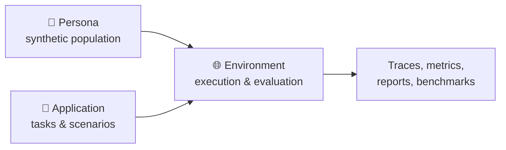

# MatrAIx

> **Simulate before reality.**

MatrAIx is an open-source project for building large-scale, persona-based agent simulations of human society.

The name is a nod to *The Matrix*: a simulated world hard to distinguish from the real one. We're exploring how far a simulated population of AI agents can stand in for real people when testing ideas before they touch the real world.

Our long-term, deliberately ambitious goal is a planet-scale simulation: on the order of **8.3 billion synthetic personas** (roughly one per person on Earth), each paired with an AI agent that holds preferences, makes decisions, and interacts with products, systems, and other agents.

> **The question we start from:** Can we build a simulated population of AI agents useful for testing ideas, products, workflows, conversations, and social systems before deploying them in the real world?

## 🔭 Vision

Modern AI systems are increasingly capable of modeling human-like preferences, communication styles, and decision-making. This creates a new opportunity: before testing every idea with real users, we may first run large-scale simulations inside AI-generated societies.

MatrAIx aims to provide the core building blocks: large-scale persona databases, persona-conditioned agents, simulation environments, task and evaluation suites, multi-agent settings, telemetry, and benchmarks for persona adherence. The long-term vision is simulation at the scale of a virtual world.

MatrAIx is not intended to replace real humans or real-world experiments. It is a pre-deployment simulation layer for research, evaluation, and rapid iteration.

## 🧩 The Three Teams

MatrAIx is organized around three teams that map onto three layers of the simulation stack. Each has its own detailed README:

| Team | Layer | What it builds | Details |
|------|-------|----------------|---------|
| 🧬 **Persona** | *who* is simulated | Large-scale persona database + train/bench subsets | [personas/](personas/README.md) |
| 🌐 **Environment** | *where* and *how* they act | Reusable execution & evaluation environments | [environments/](environments/README.md) |
| 🧪 **Application** | *what* we simulate and *why* | Task libraries & domain-specific scenarios | [applications/](applications/README.md) |



A typical simulation pipeline: select or generate personas → instantiate agents → choose an environment → define tasks and evaluation → run → collect traces → analyze → generate reports or benchmark results.

## 🙋 Join the Project

We are actively looking for collaborators across all three teams, whether you are interested in research, engineering, data, or evaluation.

> ### 👉 [**Join MatrAIx — Fill out our Google Form**](https://forms.gle/hwEHng5HGWRqcJue9)
>
> Share your background and interests, and we will get back to you as soon as possible.

🔗 Form link: **https://forms.gle/hwEHng5HGWRqcJue9**

## 📄 Publications

MatrAIx is intended to produce two initial papers, with more to follow as the project grows.

- **Paper 1 — Survey.** A survey of agent personas and user simulation: how synthetic personas and persona-conditioned agents are built, evaluated, and used to simulate users, covering existing datasets, methods, benchmarks, and open challenges.
- **Paper 2 — MatrAIx persona & user simulation.** Our own end-to-end work, presenting the MatrAIxPersona dataset and MatrAIxPersonaBench together with persona-conditioned agents used as simulated users — schema design, data generation, quality filtering, evaluation, and downstream simulation applications in a single paper.

**Timeline.** Both papers target completion over the summer of 2026.

As the project grows, we expect **additional papers** — for example, more advanced persona-agent methods, evaluation methodology, and broader, more comprehensive simulation applications.

## 🗺️ Roadmap

- **Stage 1 — Minimal stack.** Persona schema, initial persona set, basic survey + chatbot environments, first persona-adherence benchmark, simple telemetry.
- **Stage 2 — Core dataset & benchmark.** Release MatrAIxPersona-8B, MatrAIxPersonaTrain, MatrAIxPersonaBench; add domain subsets and automatic evaluation.
- **Stage 3 — Environment expansion.** Web environment, long-horizon and multi-turn tasks, memory-enabled agents, multi-agent interaction, cost/friction simulation.
- **Stage 4 — Simulated society.** Scale toward a planet-scale population with social graphs, group interaction, information diffusion, and synthetic communities.

## 🔬 Research Questions

- How should synthetic personas be represented, and how do we measure persona adherence?
- How consistent are LLM agents across long interactions?
- Can simulated users predict real user preferences?
- How do multi-agent simulations differ from single-agent feedback?
- Can lightweight self-evolving memory make agents better human stand-ins?
- What are the limitations and failure modes of persona-based simulation?

## 🤝 Contributing

We welcome contributions in all three areas — see each team's README ([Persona](personas/README.md), [Environment](environments/README.md), [Application](applications/README.md)) for specifics, plus [Contribution.md](Contribution.md) for setup and scene-authoring guidelines.

## 📁 Repository Layout

```text
matraix/
├── README.md            ← you are here (overview)
├── personas/            ← 🧬 Team 1: Persona
├── environments/        ← 🌐 Team 2: Environment
├── applications/        ← 🧪 Team 3: Application
├── benchmarks/
├── examples/
├── scripts/
├── docs/
└── configs/
```

## ⚠️ Limitations

MatrAIx is an experimental project. Synthetic users are not real users, and simulated feedback should not be treated as ground truth — use it as an additional signal for exploration, debugging, hypothesis generation, and early-stage evaluation. LLM agents may overfit to prompt wording, behave inconsistently, or introduce demographic bias; long-horizon and multi-agent behavior remain hard to evaluate. Validate important findings with real-world data whenever possible.

## 🪞 Project Philosophy

> Simulate before reality.

We believe future digital systems will increasingly be designed, tested, and improved inside AI-generated simulated environments before being deployed to the real world. MatrAIx is our attempt to build the open infrastructure for that future.
