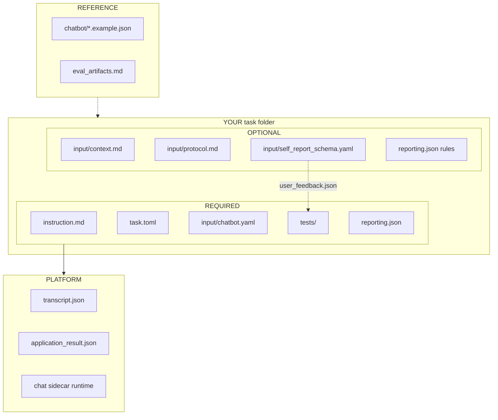

# Chatbot Application Tasks

Chatbot tasks let the simulated user interact with an application exposed
through a chat API.

**Canonical copy-from:** `application/tasks/chat_recai`

### What you author (required vs optional)

| Verifier context | Priority |
|---|---|
| `task_outcome` | **Required** |
| `conversation_summary` | Strongly recommended |
| `user_feedback` | When `self_report_schema.yaml` exists |
| `policy_and_trust`, `coordination` | Optional depth |

**Do not** add per-task `output_schema.md` — platform owns harness artifacts in
[`eval_artifacts.md`](eval_artifacts.md).

## Contract

- Task instruction: describe the chatbot application and the user's goal context.
- Interaction protocol: multi-turn user and assistant messages through the task controller.
- Runtime environment: a shared or dedicated chatbot sidecar stack plus any required resources.
- Stop conditions: max turns, persona done signal, terminal chatbot state, or task failure.
- Artifacts: transcript and eval-run summary (platform-managed), persona self-report, and evaluation result.
- Evaluation contract: artifact validation, optional objective checks, and persona self-report.

## Authoring Bundle

Contributor-facing chatbot docs use one task instruction at the task root and
supplementary materials under `input/`:

`application/tasks/<task-name>/`

- `instruction.md` — the single **persona-facing** task brief (goal, interaction
  style, stop conditions). Write it as instructions for a real person using the
  product — no file paths, transport contracts, eval jargon, or harness setup.
- `input/context.md` — optional **product / SUT background** for the persona
  (what the application is, what it does, what to expect, and which product
  capabilities a real user would use). Same rule: real-user language only —
  describe the product, not HTTP contracts or eval plumbing. Persona prompts
  load this file as-authored; do not rely on the runner to invent tool copy.
- `input/protocol.md` — optional chat API or MCP contract for the **agent /
  runtime**, never pasted into persona-facing instruction or context
- `input/chatbot.yaml` — runtime connection metadata. Treat the sidecar as a
  black box: declare transport, connection, `capabilities` (machine tool /
  HTTP wiring for UserSim), and optional `structuredExposure.fields[]`. Playground
  / Harbor pass through `runtimeDefaults` without interpreting SUT catalogs.
  Do not mirror sidecar-internal knobs in the UI.
- `input/self_report_schema.yaml` — machine-readable persona self-report prompts
  for `user_feedback.json`

Platform-managed eval artifacts (`transcript.json`, `application_result.json`) are
documented in [`eval_artifacts.md`](eval_artifacts.md). Chatbot tasks do **not**
use per-task `input/output_schema.md`; subjective feedback is owned by
`self_report_schema.yaml`.

Use machine-readable files for runtime-owned behavior:

- `chatbot.yaml` owns transport metadata and `capabilities[]` for tools.
  Persona-visible structured reply details use one name: yaml
  `structuredExposure.fields[]` (source of truth for selectors). List the
  matching capability id `structured_exposure` in `capabilities` (also
  auto-added when those fields are present). SUT JSON keys
  (`recommendedItems`, `groundedItems`, …) are not platform fields — only
  `selector` targets.
- `context.md` owns persona-facing product / capability prose
- `self_report_schema.yaml` owns the post-chat self-report contract written to
  `user_feedback.json`

`user_feedback.json` is the shared subjective feedback artifact across
interactive tasks. Chatbot tasks reuse that shared channel, then add
conversation-specific feedback fields when needed.

This keeps prompt assembly, runtime behavior, and contributor docs aligned
without parsing prose out of `instruction.md`.

Shared chatbot environments should contain only the persona agent image assets
(`shared-chat-persona`). Local endpoint hosts live under `chatbot-api-sidecar_*` or `chatbot-mcp-sidecar_*`. Do not
put task-specific prose in either place.

Choose sidecar kind from the **persona-facing** contract in `input/chatbot.yaml`:

- `transport: sidecar_http` / HTTP chat → `chatbot-api-sidecar_<sut>`
- `transport: mcp` → `chatbot-mcp-sidecar_<sut>`

A product may still use MCP (or other) tools *behind* an HTTP chat adapter.
That remains an API sidecar (see `chatbot-api-sidecar_openbb`: `finance-chatbot`
+ `openbb-mcp`). Only use `chatbot-mcp-sidecar_*` when the persona/agent calls
MCP chat tools directly.

## Reporting contract

Chatbot tasks use one shared reporting contract. It covers execution outcome,
conversation process, and persona self-report — the usual questions product
studies ask about chat experiences.

The contract is built on the generic `structured_output.json` /
`reporting.json` mechanism and should answer:

- was the user's goal actually resolved
- what happened in the conversation before the outcome
- how the persona rated the interaction
- whether policy / trust / coordination issues changed the result

This contract is informed by two complementary views:

- **Tau Bench / Tau2 Bench** style evaluation:
  end-state correctness, policy-following, communication adequacy, and
  reliability across repeated trials (`pass^k`)
- **persona-facing service quality**:
  satisfaction, effort, trust, feeling understood, and whether the next step
  was clear

Keep using the platform's existing artifact shape:

- verifier writes `verifier/structured_output.json`
- task root defines `reporting.json`
- both continue to use `contexts[]`, `facets[]`, `summaryDirectives[]`, and
  `judgeDirectives[]`

This contract adds shared context types, facet keys, and small enums so
contributors can extend task-specific details without breaking cross-task
reporting.

### Minimum Contexts

Persona-sensitive chatbot tasks should emit these contexts when applicable:

1. `task_outcome`
   The main result of the interaction. This is the only required context.
2. `conversation_summary`
   Lightweight process / effort summary for the exchange. Recommended for all
   tasks.
3. `user_feedback`
   Post-chat satisfaction, trust, or usefulness feedback. This is the shared
   interactive-task subjective channel and is recommended whenever the task
   collects self-report.
4. `policy_and_trust`
   Optional objective review of policy compliance, groundedness, escalation, or
   bounded empathy.
5. `coordination`
   Optional coordination summary for Tau2-style dual-control or follow-up
   heavy tasks where the user must take actions too.

If a task cannot produce a stable `task_outcome`, it is probably not yet a
strong persona-sensitive chatbot benchmark.

### Required Facets For `task_outcome`

The `task_outcome` context should contain these standard facets:

| Facet key | Role | Kind | Required | Notes |
|---|---|---|---|---|
| `outcome_status` | `primary` | `categorical` | Yes | Standard resolution bucket |
| `resolution_basis` | `primary` | `categorical` | Yes | What evidence grounded the outcome classification |
| `outcome_reason` | `explanation` | `textual` | Yes | Why the interaction ended in that outcome |
| `next_step_owner` | `evidence` | `categorical` | Prefer | Who owns the next meaningful action |
| `task_goal_label` | `evidence` | `textual` | Optional | Task-specific human label for the user's goal |

### Required Facets For `conversation_summary`

The `conversation_summary` context should contain these standard facets:

| Facet key | Role | Kind | Required | Notes |
|---|---|---|---|---|
| `conversation_path` | `primary` | `categorical` | Yes | Shared process bucket |
| `user_turn_count` | `score` | `numerical` | Yes | Number of user turns |
| `assistant_turn_count` | `score` | `numerical` | Yes | Number of assistant turns |
| `message_count` | `score` | `numerical` | Yes | Total visible messages |
| `process_notes` | `explanation` | `textual` | Prefer | Short narrative of how the conversation progressed |
| `clarification_question_count` | `score` | `numerical` | Optional | Count of explicit clarification turns when available |

### Recommended Facets For `user_feedback`

If the task collects self-report, keep it in a separate `user_feedback`
context. Reuse the shared feedback keys when possible, then add
conversation-specific fields only when chat semantics truly need them:

| Facet key | Role | Kind |
|---|---|---|
| `overall_experience_rating` | `score` | `numerical` |
| `feedback_reason` | `explanation` | `textual` |
| `need_constraint_satisfaction` | `evidence` | `categorical` |
| `personal_preference_satisfaction` | `evidence` | `categorical` |
| `clarification_questions_useful` | `primary` | `categorical` |
| `trust_level` | `score` | `numerical` |
| `effort_rating` | `score` | `numerical` |
| `felt_understood` | `evidence` | `categorical` |

### Recommended Facets For `policy_and_trust`

Use a `policy_and_trust` context when objective policy or trust checks matter:

| Facet key | Role | Kind |
|---|---|---|
| `policy_compliance` | `primary` | `categorical` |
| `groundedness_primary` | `primary` | `categorical` |
| `policy_notes` | `explanation` | `textual` |
| `handoff_appropriateness` | `evidence` | `categorical` |

### Recommended Facets For `coordination`

Use a `coordination` context for follow-up heavy or dual-control tasks:

| Facet key | Role | Kind |
|---|---|---|
| `coordination_mode` | `primary` | `categorical` |
| `state_change_achieved` | `evidence` | `categorical` |
| `user_action_required` | `evidence` | `categorical` |
| `guidance_quality` | `primary` | `categorical` |
| `coordination_notes` | `explanation` | `textual` |

### Shared Enumerations

Contributors should reuse these enums where possible instead of inventing
near-duplicates.

`outcome_status`

- `resolved`
- `partially_resolved`
- `unresolved`
- `escalated`
- `abandoned`
- `blocked`

`resolution_basis`

- `tool_state`
- `conversation_commitment`
- `user_feedback`
- `policy_guardrail`
- `other`

`conversation_path`

- `direct_resolution`
- `clarify_then_resolve`
- `clarify_then_partial`
- `handoff_or_followup`
- `stalled`
- `other`

`need_constraint_satisfaction` / `personal_preference_satisfaction`

- `yes`
- `partially`
- `no`

`next_step_owner`

- `none`
- `agent`
- `user`
- `external`
- `shared`

`policy_compliance`

- `pass`
- `warn`
- `fail`
- `not_evaluated`

`groundedness_primary`

- `verified`
- `mixed`
- `unsupported`
- `not_evaluated`

`coordination_mode`

- `agent_only`
- `user_followup_required`
- `shared_world`
- `handoff`
- `other`

`guidance_quality`

- `clear`
- `partial`
- `confusing`
- `not_applicable`

For boolean-like evidence fields such as `clarification_questions_useful`,
`felt_understood`, `state_change_achieved`, or `user_action_required`, encode
them as categorical `true` / `false` values.

### Tau Bench Mapping

This contract is intentionally compatible with Tau Bench style evaluation:

- **DB / end-state checks** should usually map into `task_outcome`, often with
  `resolution_basis = tool_state`
- **ACTION / path strictness** should only be enforced when the exact action
  path is uniquely required; otherwise prefer end-state semantics
- **communication adequacy** should inform `conversation_summary`,
  `user_feedback`, or `policy_and_trust`
- **pass^k** is a job-level reliability metric over repeated trials, not a
  single-trial facet; the per-trial contract should make that aggregation easy
  by exposing stable outcome categories

### Contributor Extension Rules

- Keep the standard facet keys exactly as written above.
- Put task-specific additions behind a `task_` prefix, for example
  `task_domain`, `task_resolution_channel`, or `task_recommended_item_count`.
- Prefer a small shared enum plus `other` instead of inventing near-synonym
  categories for every task.
- Keep `outcome_reason`, `process_notes`, and `feedback_reason` as natural
  language from the relevant perspective.
- Do not bake reporting policy into the verifier; use `reporting.json` for
  summaries and judges.

### Default Reporting Pattern

For persona-sensitive chatbot tasks, the default `reporting.json` should
usually:

- summarize `outcome_reason` by `outcome_status`
- summarize `process_notes` by `conversation_path`
- summarize `feedback_reason` by `clarification_questions_useful` when feedback
  exists
- optionally judge `outcome_reason` / `feedback_reason` for reusable signals
  like effort, trust, empathy, policy blocks, or follow-up burden

See the example templates in this folder:

- `chatbot_structured_output.example.json`
- `chatbot_reporting.example.json`

## Canonical Task

`application/tasks/chat_recai`

The recommender task hosts a small REST sidecar that follows the same contract
as heavier chatbot applications: session creation, message exchange,
conversation export, and final recommendation export.

Shared chatbot persona agent runtime:

- `environment/task-environments/application/shared-chat-persona`

Optional local endpoint hosts (not the persona agent image):

- `environment/task-environments/application/chatbot-api-sidecar_recai`
- `environment/task-environments/application/chatbot-api-sidecar_openbb`
- `environment/task-environments/application/chatbot-api-sidecar_acme-support-api`
- `environment/task-environments/application/chatbot-api-sidecar_multi-agent-medical-assistant`
- `environment/task-environments/application/chatbot-mcp-sidecar_acme-support`

See [`CHAT_ENVS.md`](../../../environment/task-environments/application/CHAT_ENVS.md)
for which protocol each package exposes to the persona.
