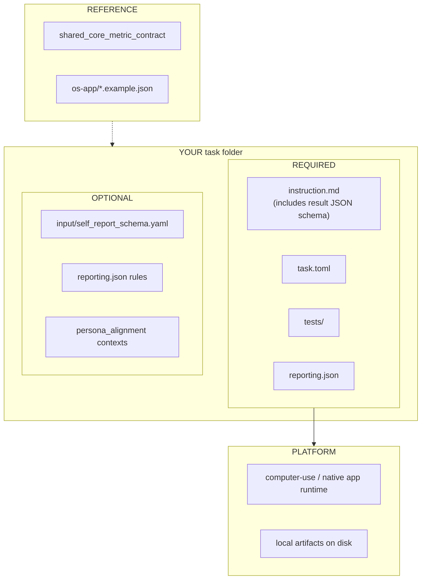

# OS / App Evaluation Contract

This folder defines the shared evaluation and reporting contract for native
desktop/mobile app tasks and cross-app operating workflows.

**Canonical copy-from:** `application/tasks/example-computer-use-ios_photo-access-review`

### What you author (required vs optional)

Outcome-based verification (final state, not action sequence). Reuse the **same shared core**
as web ([shared-core-metrics.md](../shared-core-metrics.md)); add scenario-specific contexts on top.

| Context | Priority |
|---|---|
| `task_outcome` | **Required** |
| `goal_component`, `side_effects` | Strongly recommended |
| `user_feedback`, `persona_alignment` | When the study needs them |
| `infeasibility` | When tasks can be intentionally blocked |

Use this folder when the benchmark question is fundamentally:

- did the agent complete the requested app task
- did it avoid harmful side effects
- did it act in a way that matches the persona when persona matters

Use `../web/README.md` for browser-mediated web tasks. Use this folder for
native app, settings, file, and cross-app operating benchmarks.

Use [`../shared-core-metrics.md`](../shared-core-metrics.md) as the source of truth for the shared core context names,
facet keys, and reuse rules that `os-app/` shares with `web/`. See
`../shared_core_metric_contract.example.json` for the machine-readable
companion.

## Core Principle

The default evaluation contract should be outcome-based:

- verify the final state or submitted artifact, not an exact action sequence
- allow multiple valid paths to the same goal
- keep binary success as the main benchmark metric
- add partial-credit and failure-breakdown metrics for analysis, not leaderboard
  replacement
- explicitly track collateral damage, infeasibility handling, and terminal/script
  bypass

This follows the most useful pattern shared by strong execution-based
benchmarks such as OSWorld and WebArena:

- OSWorld emphasizes execution-based end-state verification.
- WebArena emphasizes functional correctness rather than trajectory matching.
- Extend this with state-based assertions, scenario consistency, and collateral
  damage checks when your task family benefits from them.

## Primary Benchmark Metrics

Use a small metric set for headline reporting:

1. `task_success_rate`
   Percentage of feasible tasks with `outcome_status = passed`.
2. `scenario_success_rate`
   Percentage of scenarios or templates for which the agent solved all included
   variants.
3. `goal_or_abort_correct_rate`
   Percentage of tasks correctly resolved as either `passed` or
   `infeasible_correct`. Use this when the benchmark intentionally mixes
   feasible and infeasible tasks.

Keep `task_success_rate` as the main external metric.

## Diagnostic Metrics

Use these for internal analysis and model comparisons:

- `goal_completion_ratio_mean`
  Weighted fraction of required goal components passed.
- `goal_component_pass_rate`
  Pass rate over repeated `goal_component` checks.
- `side_effect_free_rate`
  Share of tasks with no collateral damage.
- `blocking_side_effect_rate`
  Share of tasks with collateral damage severe enough to invalidate success.
- `infeasibility_handling_rate`
  Accuracy on tasks where the correct behavior is to stop and explain the block.
- `used_terminal_or_script_rate`
  How often the agent bypassed GUI interaction with terminal or scripts.
- `median_step_count` / `p90_wall_clock_seconds`
  Efficiency diagnostics only; do not use as the main quality metric.

## Minimum Contexts

OS/app tasks should emit these contexts when applicable:

1. `task_outcome`
   Required. One per task. Encodes the benchmark-facing result.
2. `goal_component`
   Recommended. One per major required subgoal or verifier assertion group.
3. `user_feedback`
   Recommended whenever the task collects post-run self-report.
4. `side_effects`
   Recommended. Captures unexpected edits, duplicate actions, unsafe behavior,
   or other collateral damage.
5. `execution_profile`
   Recommended. Captures steps, runtime, app count, and whether the agent used
   GUI vs terminal/script paths.
6. `infeasibility`
   Optional but strongly recommended when some tasks are intentionally blocked,
   unsupported, or impossible.

If a task cannot define a stable `task_outcome`, it is probably not ready for a
shared benchmark.

## Required Facets For `task_outcome`

| Facet key | Role | Kind | Required | Notes |
|---|---|---|---|---|
| `outcome_status` | `primary` | `categorical` | Yes | Main result bucket |
| `goal_completion_ratio` | `score` | `numerical` | Yes | `0.0` to `1.0` weighted completion |
| `goal_completion_bucket` | `primary` | `categorical` | Yes | Shared partial-credit bucket |
| `verifier_mode` | `evidence` | `categorical` | Yes | How the verifier checked success |
| `primary_failure_reason` | `primary` | `categorical` | Prefer | Shared failure taxonomy |
| `outcome_explanation` | `explanation` | `textual` | Yes | Short verifier-facing summary |
| `completion_evidence` | `evidence` | `textual` | Prefer | Concrete state or artifact evidence |

## Recommended Facets For `goal_component`

| Facet key | Role | Kind | Notes |
|---|---|---|---|
| `goal_component_key` | `evidence` | `categorical` | Stable machine-readable id |
| `goal_component_label` | `evidence` | `textual` | Human-readable description |
| `goal_component_status` | `primary` | `categorical` | Shared pass/fail bucket |
| `goal_component_weight` | `score` | `numerical` | Weight used in completion ratio |
| `goal_component_required` | `evidence` | `categorical` | Encode as `true` / `false` |
| `goal_component_evidence` | `explanation` | `textual` | Concrete pass/fail rationale |

## Recommended Facets For `side_effects`

| Facet key | Role | Kind | Notes |
|---|---|---|---|
| `collateral_damage_present` | `primary` | `categorical` | Encode as `true` / `false` |
| `blocking_side_effect_present` | `primary` | `categorical` | Encode as `true` / `false` |
| `damage_severity` | `primary` | `categorical` | Shared severity bucket |
| `damage_type_primary` | `primary` | `categorical` | Shared damage taxonomy |
| `unsafe_action_present` | `evidence` | `categorical` | Encode as `true` / `false` |
| `side_effect_notes` | `explanation` | `textual` | Free-text verifier notes |

## Recommended Facets For `execution_profile`

| Facet key | Role | Kind | Notes |
|---|---|---|---|
| `task_archetype` | `primary` | `categorical` | Shared task-family bucket |
| `used_gui_primary` | `evidence` | `categorical` | Encode as `true` / `false` |
| `used_terminal_or_script` | `evidence` | `categorical` | Encode as `true` / `false` |
| `apps_touched_count` | `score` | `numerical` | Distinct apps or major surfaces |
| `step_count` | `score` | `numerical` | Agent-visible action count |
| `wall_clock_seconds` | `score` | `numerical` | End-to-end task time |
| `recovery_count` | `score` | `numerical` | Count of meaningful recoveries |

## Recommended Facets For `infeasibility`

| Facet key | Role | Kind | Notes |
|---|---|---|---|
| `infeasible_expected` | `primary` | `categorical` | Encode as `true` / `false` |
| `agent_declared_infeasible` | `primary` | `categorical` | Encode as `true` / `false` |
| `infeasibility_reason_match` | `primary` | `categorical` | Shared agreement bucket |
| `declared_before_side_effects` | `evidence` | `categorical` | Encode as `true` / `false` |
| `infeasibility_notes` | `explanation` | `textual` | Why the block was or was not handled correctly |

## Shared Subjective Feedback

When an OS/app task asks for post-run persona self-report:

- write the raw artifact to `user_feedback.json`
- define task-owned questions in `input/self_report_schema.yaml`
- map the result into the shared `user_feedback` context

Use `user_feedback` as the default subjective reporting home for satisfaction,
effort, trust, or clarity signals. Persona-specific or archetype-specific
contexts can add narrower slices, but they should not replace the shared
feedback context.

## Recommended Facets For `user_feedback`

| Facet key | Role | Kind | Notes |
|---|---|---|---|
| `overall_experience_rating` | `score` | `numerical` | Overall subjective rating |
| `feedback_reason` | `explanation` | `textual` | Why the run felt good, bad, or mixed |
| `need_constraint_satisfaction` | `evidence` | `categorical` | Shared satisfaction bucket |
| `personal_preference_satisfaction` | `evidence` | `categorical` | Shared satisfaction bucket |
| `trust_level` | `score` | `numerical` | Confidence in the result or workflow |
| `effort_rating` | `score` | `numerical` | Perceived effort or friction |
| `clarity_of_next_step` | `evidence` | `categorical` | Whether the next action felt clear |

## Persona reporting layer

When the benchmark is not only "can the agent finish the task" but also "did it
act in a persona-consistent way" or "did different personas make different
choices", add the **persona layer** on top of the execution metrics above.

Use the persona layer when:

- the persona changes what should be chosen
- the persona changes which tradeoff is correct
- the persona introduces hard constraints such as privacy, budget, familiarity,
  accessibility, or risk tolerance

Recommended persona-specific metrics:

- `persona_alignment_rate`
  Share of tasks with `persona_alignment_status = aligned`.
- `critical_persona_constraint_success_rate`
  Pass rate on hard persona constraints.
- `persona_consistency_rate`
  Consistency across related task variants for the same persona.

### Persona Contexts

1. `persona_alignment`
   Recommended when persona is part of the evaluation target. One per task.
2. `persona_constraint`
   Recommended when the task has explicit or inferable persona constraints.
   Repeat one context per important constraint.
3. `decision` / `decision_process`
   Optional. Reuse these when the OS/app task includes a meaningful choice among
   multiple valid options, not only a deterministic edit.

### Recommended Facets For `persona_alignment`

| Facet key | Role | Kind | Notes |
|---|---|---|---|
| `persona_alignment_status` | `primary` | `categorical` | Shared overall alignment bucket |
| `persona_alignment_score` | `score` | `numerical` | `0.0` to `1.0` |
| `persona_preference_axis_primary` | `primary` | `categorical` | Main persona dimension that mattered |
| `persona_signal_source` | `evidence` | `categorical` | Where the persona cue came from |
| `persona_alignment_explanation` | `explanation` | `textual` | Why the run is or is not persona-aligned |

### Recommended Facets For `persona_constraint`

| Facet key | Role | Kind | Notes |
|---|---|---|---|
| `persona_constraint_key` | `evidence` | `categorical` | Stable machine-readable id |
| `persona_constraint_type` | `primary` | `categorical` | Shared persona constraint taxonomy |
| `persona_constraint_priority` | `evidence` | `categorical` | `hard` / `soft` |
| `persona_constraint_status` | `primary` | `categorical` | Shared satisfaction bucket |
| `persona_constraint_evidence` | `explanation` | `textual` | Concrete rationale or evidence |

### Persona Enumerations

`persona_alignment_status`

- `aligned`
- `partially_aligned`
- `misaligned`
- `not_applicable`

`persona_preference_axis_primary`

- `privacy`
- `frugality`
- `convenience`
- `accessibility`
- `trust`
- `familiarity`
- `speed`
- `quality`
- `risk_aversion`
- `other`

`persona_signal_source`

- `persona_profile`
- `task_instruction`
- `dialog_context`
- `history_or_memory`
- `multiple`

`persona_constraint_type`

- `privacy`
- `budget`
- `accessibility`
- `familiarity`
- `brand_preference`
- `speed`
- `quality_bar`
- `risk_limit`
- `other`

`persona_constraint_status`

- `satisfied`
- `partially_satisfied`
- `violated`
- `not_triggered`
- `unknown`

### Persona reporting pattern

When the persona layer applies, extend `reporting.json` with rules from
`os_app_persona_reporting.example.json`. It should usually:

- summarize `feedback_reason` by `need_constraint_satisfaction` when shared
  feedback exists
- summarize `persona_alignment_explanation` by `persona_alignment_status`
- summarize `persona_constraint_evidence` by `persona_constraint_type`
- summarize `persona_constraint_evidence` by `persona_constraint_status`
- optionally judge `persona_alignment_explanation` for reusable signals such as
  privacy sensitivity, convenience seeking, risk avoidance, or familiarity bias

## Shared Enumerations

`outcome_status`

- `passed`
- `failed`
- `infeasible_correct`
- `infeasible_incorrect`
- `error`

`goal_completion_bucket`

- `none`
- `partial`
- `near_complete`
- `complete`

`verifier_mode`

- `state_exact`
- `state_tolerant`
- `artifact_exact`
- `artifact_semantic`
- `hybrid`

`goal_component_status`

- `passed`
- `failed`
- `blocked`
- `not_attempted`

`primary_failure_reason`

- `none`
- `navigation`
- `grounding`
- `tool_use`
- `misread_instruction`
- `missing_knowledge`
- `validation_mismatch`
- `environment`
- `unsafe_action`
- `other`

`damage_severity`

- `none`
- `minor`
- `major`

`damage_type_primary`

- `none`
- `wrong_edit`
- `extra_edit`
- `duplicate_action`
- `destructive_change`
- `privacy_leak`
- `spurious_submission`
- `other`

`task_archetype`

- `settings_change`
- `info_retrieval_submission`
- `file_transform`
- `cross_app_workflow`
- `content_creation`
- `transactional_flow`
- `other`

`infeasibility_reason_match`

- `matched`
- `partial`
- `mismatched`
- `not_applicable`

`need_constraint_satisfaction` / `personal_preference_satisfaction`

- `yes`
- `partially`
- `no`

## Contributor Extension Rules

- Keep the standard facet keys exactly as written above.
- Put task-specific additions behind a `task_` prefix.
- Prefer repeated `goal_component` or `persona_constraint` contexts over
  inventing a new top-level score for every task.
- Keep `user_feedback` as the shared subjective entry point whenever a task
  collects post-run self-report.
- Compute binary success from outcome semantics, not from action-sequence
  matching.
- If terminal or script use is allowed, still record it so results can be sliced
  separately from GUI-first performance.
- Pin the task bundle and verifier version in reports. OS/app benchmarks become
  hard to interpret when instructions or verifiers drift over time.

## Recommended Three-Example Starter Set

Avoid publishing three near-identical settings tasks. A better starter set is:

1. `settings_change`
   Example: enable a specific app permission in iOS Settings, then verify the
   target app can import one photo and no unrelated permissions changed.
2. `file_transform`
   Example: update a spreadsheet in LibreOffice Calc, fill required cells,
   export a CSV to a target folder, and verify both table contents and output
   file.
3. `cross_app_workflow`
   Example: read travel details from an email or PDF, create a calendar event
   with the correct date, time, and location, and verify no duplicate event was
   created.

These three archetypes cover a large share of practical OS/app tasks without
repeating the same benchmark pattern.

## Example templates

**Execution layer**

- `os_app_metric_structured_output.example.json`
- `os_app_metric_reporting.example.json`

**Persona layer** (merge into the same task files when persona variation matters)

- `os_app_persona_structured_output.example.json`
- `os_app_persona_reporting.example.json`
