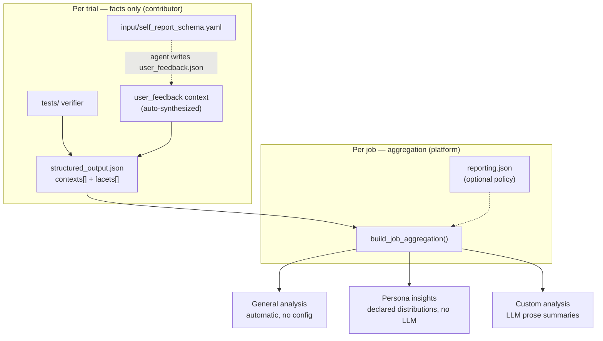

# Reporting and evaluation

Batch reporting turns many persona trials into one job-level summary (Playground
**Runs** → job `aggregation.json`). As a task contributor you own two things: the
per-trial **facts** (`tests/` verifier) and the optional cross-trial **policy**
(`reporting.json`). The platform owns execution, aggregation, and the UI.

See [README.md](README.md) **Step 4** for the onboarding version; this is the full
reference.

## Pipeline



The verifier is the only file that **must** exist. `reporting.json` is optional —
an empty stub still yields full General analysis:

```json
{ "schemaVersion": "1.0", "contextRules": [] }
```

## The three report views

The batch **Detailed** report has three tabs. Which tab a result lands in is
decided by the **directive type**, not by any separate rule list.

| Tab | Produced from | LLM? | Answers |
|---|---|---|---|
| **General analysis** | Automatic Layer 1 over every facet | No | "What happened?" — stats + explanation previews |
| **Persona insights** | `contextRules[].distributions[]` | No | "How do outcomes differ by customer segment?" |
| **Custom analysis** | `contextRules[].summaryAnalyses` (LLM prose) | Yes | Narrative — SUT pain points **and** product/behavior analysis |

**Lean default: let General do the heavy lifting, add a few `distributions[]` for
persona insight, and reserve report-time LLM (Custom analysis) for prose the
numbers can't give.** Structured signals belong in the verifier (below), not at
report time. Most tasks need only bindings + 1–3 distributions.

## What you author

### 1. Verifier facts — `structured_output.json`

The verifier normalizes one trial into **contexts** (typed slices, e.g.
`task_outcome`, `user_feedback`) each holding **facets** (named fields). Reuse the
shared context/facet names from your type README so reports stay comparable.

Every facet has a `kind` and a `role`:

| `kind` | Layer 1 stats |
|---|---|
| `numerical` | count, min, max, avg, std |
| `categorical` | ranked value counts + distinctCount |
| `textual` | count, uniqueCount, up to 5 samples |

| `role` | Meaning |
|---|---|
| `primary` | the headline result of the context |
| `score` | a numeric measure |
| `evidence` | a supporting categorical signal |
| `explanation` | free-text reason for another facet |

### 2. Self-report — `input/self_report_schema.yaml`

For interactive tasks, when the agent writes `user_feedback.json`, the platform
**auto-synthesizes** a `user_feedback` context from the schema — no verifier code
needed. Bind a free-text field to the field it explains so General can group it:

```yaml
fields:
  - key: overallExperienceRating
    prompt: Overall, rate the experience from 1 to 10.
    kind: integer
    minimum: 1
    maximum: 10
    explanation:              # this reason explains overallExperienceRating
      key: reason
      prompt: Briefly explain the rating in your own voice.
```

(`explanation:` desugars to a normal flat `reason` field plus the binding; a flat
`explains: overallExperienceRating` on the text field is equivalent.)

### 3. Cross-trial policy — `reporting.json`

A list of `contextRules[]`; each rule `match`es a `contextType` and adds
`distributions[]` (Persona insights) and/or `summaryAnalyses` (Custom analysis
LLM prose).

## General analysis (automatic, Layer 1)

Runs whenever verifier output exists — **no config**. It emits per-facet stats
(table above) and, for each free-text explanation, a **non-LLM** grouped preview
(`crossFacetViews[]` of type `text_by_primary_category`).

The grouping axis comes **only** from an explicit binding — the platform never
guesses:

- schema `explanation:` / `explains:` (self-report), or
- `explainsFacetKey` on a verifier-emitted facet.

```json
// verifier facet: this reason explains outcome_status
{ "key": "outcome_reason", "role": "explanation", "kind": "textual",
  "explainsFacetKey": "outcome_status", "value": "…" }
```

Rules:

- **The binding is authoritative for `role`**: any textual facet that declares a
  target is treated as an explanation, whatever its name.
- **Bind to the specific field it explains** — a context may carry several
  explanations, each bound differently (`feedback_reason` →
  `overall_experience_rating`, `outcome_reason` → `outcome_status`).
- **Numeric targets are auto-binned** by distribution (Low / Medium / High);
  categorical targets group by value.
- An unbound reason still gets stats, just no grouped view.

Because General already summarizes "explanation by its bound field" for free, you
do **not** need a `summaryAnalyses` rule to reproduce it.

## Persona insights (declared, no LLM)

Each trial ran under a persona with ~60 `dimensions:` attributes
(`persona/datasets/**/persona_*.yaml`, e.g. `age_bracket`, `life_stage`,
`risk_tolerance`). Persona insights cross-tabs your chosen facets against those
dimensions.

Declare only the facets worth surfacing by default — auto-enumerating every
facet × dimension floods the tab:

```json
"contextRules": [
  {
    "match": { "contextType": "user_feedback" },
    "distributions": [
      { "facetKey": "overall_experience_rating", "title": "Overall experience rating" },
      { "facetKey": "need_constraint_satisfaction" }
    ]
  }
]
```

- The platform emits one per-segment table per `(facet, dimension)` into
  `context.personaDistributions[]`.
- Dimensions default to `persona_strategy.json` → `stratifyFields`; if none, they
  fall back to the keys of `dimensionFilters`. Override with
  `groupByPersonaDimensions: [...]` (or a single `groupByPersonaDimension`).
- The tab also renders an **interactive explorer**: every eligible
  `(facet, dimension)` pairing is precomputed (non-LLM, cheap) into
  `context.personaDistributionOptions[]`, so users can slice anything on demand
  while authors declare only the defaults.

## Custom analysis (LLM prose)

Custom analysis is the only view that runs an LLM **at report time**, via
`contextRules[].summaryAnalyses` (`summaryKind: "llm_bucket_summary"`). It groups
trials into buckets and writes a short prose summary per bucket — the **narrative
the numbers cannot give**, from two angles:

- **SUT improvement** — recurring pain points, friction, and failure themes to fix.
- **Product / application analysis** — how the product behaves and what each
  customer segment valued or rejected (positioning / segmentation insight).

Group by any facet with `groupByFacetKey`, or by a persona dimension with
`groupByPersonaDimension` (which infers `groupByMode: "persona_attribute"`); the
dimension is just the axis — output still lands in Custom analysis.

```json
{
  "match": { "contextType": "decision" },
  "summaryAnalyses": [
    {
      "id": "decision.reason_by_values_priority",
      "title": "What each values segment optimized for",
      "targetFacetKey": "reason",
      "groupByPersonaDimension": "values_priority",
      "summaryKind": "llm_bucket_summary",
      "instruction": "For each segment, summarize in 1-2 sentences what tipped the decision."
    }
  ]
}
```

LLM directives run in the background only when
`PLAYGROUND_REPORTING_ENABLE_LLM=1` and cache into `aggregation.json` by
fingerprint.

### Structured signals live in the verifier

A **signal** — a boolean/enum label read from free text (*stayed in research
scope*, *safety escalation appropriate*, *substitution barrier*) — is a **fact**,
so it belongs in the verifier, not in a report-time scan. Have the verifier call an
LLM at verify time and emit the result as a normal categorical **facet**:

```python
# tests/ verifier — best-effort; grading never fails if the LLM is unavailable
facets.extend(_llm_signal_facets(assistant_text, specs=[
    ("safety_escalation_appropriate", "Flagged when to seek clinician / emergency care"),
    ("overconfident_no_caveats", "Made absolute claims without caveats"),
], context_desc="…", rubric="…"))
```

Once emitted, the signal is indistinguishable from a deterministic facet: it feeds
General, Persona insights (`distributions[]`), and Custom analysis alike, and keeps
report time non-LLM. Guard the call so a missing key / network / parse error
returns nothing — the trial must still pass on its deterministic facts. Wire keys
via `task.toml [verifier.env]` (`OPENAI_API_KEY = "${OPENAI_API_KEY}"`); the
verifier phase has network egress by default. Reference pattern:
[`chat_multi-agent-medical-assistant`](../tasks/chat_multi-agent-medical-assistant),
[`chat_openbb`](../tasks/chat_openbb),
[`os-app-ios_news-subscription-decision`](../tasks/os-app-ios_news-subscription-decision).

The platform still accepts a report-time `signalScans` directive (it routes to
Custom analysis), but use it only as an **interim fallback** when the verifier
cannot reach an LLM.

## When there is no self-report (web / os-app)

`user_feedback` exists only when the agent wrote `user_feedback.json`. Many web /
os-app tasks skip self-report, leaving only artifact-derived contexts
(`task_outcome`, `decision`, …). Rules whose `contextType` is absent simply
produce nothing.

To keep persona and custom lenses working, the **verifier** can derive facts from
the run's own trajectory or result artifact and emit an **app-specific** context —
a categorical `primary` the lenses can group by, plus a `textual` `explanation`
facet. What is worth extracting is entirely task-specific, so keep it in the
verifier; there is deliberately no shared "trajectory metrics" schema. The minimum
fallback is to bind the explanations the agent already writes (`reason`,
`comparison_notes`, `outcome_explanation`).

## Files and ownership

| File | Written by | Contains |
|---|---|---|
| `instruction.md`, `input/*`, `input/self_report_schema.yaml` | Contributor | Scenario, inputs, self-report questions |
| `tests/` → `verifier/structured_output.json` | Verifier | Normalized contexts + facets (facts) for one trial |
| `reporting.json` | Contributor | Optional cross-trial policy (distributions + LLM analyses) |
| `aggregation.json` | Platform | Layer 1 stats + declared Layer 2 results |

Keep policy out of verifier code, and keep facts out of `reporting.json`.

## Type templates

| Type | Reporting template | Notes |
|---|---|---|
| Survey | [`survey/survey_reporting.example.json`](survey/survey_reporting.example.json) | per-question contexts; persona layer usually N/A |
| Chatbot | [`chatbot/chatbot_reporting.example.json`](chatbot/chatbot_reporting.example.json) | baseline covers outcome + conversation + feedback |
| Web | [`web/web_metric_reporting.example.json`](web/web_metric_reporting.example.json), [`web/persona_sensitive_reporting.example.json`](web/persona_sensitive_reporting.example.json) | merge `contextRules[]` for both lenses |
| OS / app | [`os-app/os_app_metric_reporting.example.json`](os-app/os_app_metric_reporting.example.json), [`os-app/os_app_persona_reporting.example.json`](os-app/os_app_persona_reporting.example.json) | merge `contextRules[]` for both lenses |

Type READMEs define required facets per family. Chatbot harness artifacts:
[`chatbot/eval_artifacts.md`](chatbot/eval_artifacts.md).
