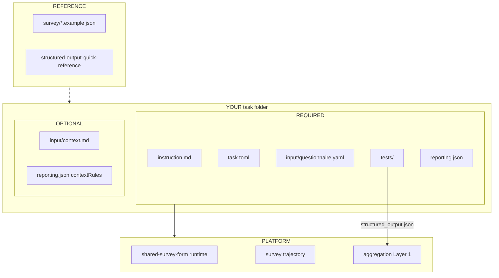

# Survey Application Tasks

Survey tasks ask the simulated user to answer a defined form or questionnaire.
The active survey protocol uses a generic survey-form task. The application
runner supplies the survey instrument as task context, then maps the resulting
artifact into answers, metrics, and a telemetry-style trajectory.

**Canonical copy-from:** `application/tasks/example-survey_product-feedback`

### What you author (required vs optional)



| Verifier emits | Priority |
|---|---|
| `question_response` per question | **Required** |
| `trial_summary` | **Required** |
| Layer 2 summarize `reason` by `response` | Only when `askRationale` is on |

## Contract

- Task instruction: define the task steps, constraints, and submission requirements.
- Interaction protocol: answer a structured survey instrument.
- Shared runtime: the generic `shared-survey-form` environment plus a task-supplied instrument bundle.
- Stop conditions: `survey_result.json` exists and matches the schema.
- Artifacts: platform-owned survey result JSON with `answers` and `trajectory`.
- Evaluation contract: schema validation, answer coverage, type checks, and metrics.

## Authoring Bundle

Survey task content uses one task instruction at the task root and
supplementary materials under `input/`:

`application/tasks/<task-name>/`

- `instruction.md` — what this survey is for and how to answer (task goal +
  answer rules). Do **not** put platform paths like `/app/output/survey_result.json`
  here; the runtime writes that artifact for you.
- `input/context.md` — product brief / scenario the respondent must read before
  answering (what the app or concept is). Keep answer mechanics out of context.
- `input/questionnaire.yaml` — the canonical structured questionnaire source,
  including whether each answer should include `rationale` / `confidence`

Split of concerns:

| Asset | Put here | Keep out |
|---|---|---|
| `instruction.md` | Survey goal, what to decide/react to, answer rules | Long product prose, platform file paths |
| `input/context.md` | Product/scenario brief the persona needs | Choice-id mechanics, submission paths |
| `questionnaire.yaml` | Questions, types, options, ask flags | Marketing essays |

`questionnaire.yaml` is the source of truth for question structure, answer
metadata flags (`askRationale` / `askConfidence`), UI rendering, and the
platform-derived answer envelope. Do **not** add `input/output_schema.md` —
the auto / host survey path writes `survey_result.json` for you, and the
backend appends the standardized survey trajectory after the run.

Keep persona framing out of these task docs. The persona is injected separately
by the runtime; `instruction.md` should stay focused on what the task requires.

## `questionnaire.yaml` Contract

The current contract is meant to cover the common 80-90% case:

```yaml
schemaVersion: "1.0"
id: example_survey_v1
title: Example Survey
description: Optional one-line summary.
# askRationale / askConfidence default to false; set true to opt in.
questions:
  - id: q1
    prompt: How likely are you to try this product?
    type: likert
    construct: adoption_intent
    required: true
    minValue: 1
    maxValue: 5
  - id: q2
    prompt: Which choice best matches your default reaction?
    type: single_choice
    construct: price_stance
    required: true
    askRationale: true
    options:
      - id: avoid_paying
        label: I would avoid paying unless absolutely necessary.
      - id: pay_if_value_clear
        label: I would pay once the value is obvious.
```

Supported question types:

- `likert`
- `single_choice`
- `multi_choice`
- `free_text`

Instrument-level defaults:

- `askRationale` (default `false`) — whether answers include a short reason
- `askConfidence` (default `false`) — whether answers include a 0–1 confidence

Per-question `askRationale` / `askConfidence` override the instrument defaults
when set. Omit both to keep answer metadata off.

For choice questions:

- `options` should normally be a list of objects with at least `id` and `label`
- `id` is the machine-stable value that the agent must emit in `answers[].value`
- `label` is what the UI should show contributors and reviewers
- `description` is optional extra display/help text

Notes:

- `questionId` in runtime answers must match `questions[].id` exactly.
- Keep `id`, question ids, and option ids stable once data has been collected.
- Put long scenario prose in `context.md`, not inside `questionnaire.yaml`.
- Do **not** author a separate `output_schema.md`; the platform derives the
  answer envelope from this questionnaire.

## Reporting contract

Survey tasks use the same generic `structured_output.json` / `reporting.json`
mechanism as other application tasks. The verifier reads `survey_result.json`
and emits normalized contexts for batch aggregation.

This contract should answer:

- what the persona answered for each question (choice id / likert / bool / text)
- how many answers and trajectory events the trial produced
- optionally why, only when the questionnaire opts into `askRationale`

Keep using the platform's existing artifact shape:

- verifier writes `verifier/structured_output.json`
- task root defines `reporting.json`
- both continue to use `contexts[]`, `facets[]`, `summaryAnalyses[]`, and
  optional `signalScans[]`

See the example templates in this folder:

- `survey_structured_output.example.json`
- `survey_reporting.example.json`

### Minimum Contexts

Survey verifiers should emit these contexts:

1. `question_response`
   Required. One context per answered question. Use a stable key such as
   `question.<questionId>`.
2. `trial_summary`
   Required. One context per trial, usually keyed as `survey.summary`.

If a survey task cannot produce stable per-question contexts, it is probably not
ready for shared batch reporting.

### Required Facets For `question_response`

Emit one `question_response` context for each entry in `survey_result.json`
`answers[]`. The question id in `answers[].questionId` must match
`questionnaire.yaml`.

| Facet key | Role | Kind | Required | Notes |
|---|---|---|---|---|
| `response` | `primary` | `numerical`, `categorical`, or `textual` | Yes | Use `numerical` for likert values, `categorical` for choice ids, `textual` for free-text answers |
| `reason` | `explanation` | `textual` | Only if asked | Map from `answers[].rationale` when `askRationale` is true |
| `confidence` | `score` | `numerical` | Only if asked | Map from `answers[].confidence` when `askConfidence` is true |

The context `label` should normally be the question prompt or a stable question
id. The context `key` should stay stable across trials, for example
`question.q1`.

### Required Facets For `trial_summary`

The `trial_summary` context summarizes the whole survey trial:

| Facet key | Role | Kind | Required | Notes |
|---|---|---|---|---|
| `answer_count` | `score` | `numerical` | Yes | Number of answers emitted |
| `trajectory_event_count` | `score` | `numerical` | Yes | Number of standardized trajectory events |
| `mean_numeric_answer` | `score` | `numerical` | Optional | Include when the survey has numeric answers |

### Default Reporting Pattern

Default surveys answer with `questionId` + `value` only. Use an empty
`contextRules` list so Layer 1 aggregates without LLM rollups:

```json
{
  "schemaVersion": "1.0",
  "contextRules": []
}
```

**What Layer 1 shows by questionnaire type:**

| Question type | Aggregation form |
|---|---|
| `likert` | Mean / range of numeric scores |
| `single_choice` / `multi_choice` | Full response-mix bars (option ids → counts) |
| `free_text` | Coverage summary + example quotes — **not** fake % bars |

To extract themes / signals from `free_text` (or from `reason` when
`askRationale` is true), add Layer 2 `summaryAnalyses` /
`signalScans` in `reporting.json` that target the `response` or
`reason` facet. See `survey_reporting.example.json` and
`application/tasks/README.md` for a reason-by-response example.

Copy from:

- `survey_reporting.example.json`
- `application/tasks/example-survey_product-feedback/reporting.json`

### Contributor Extension Rules

- Keep the standard facet keys exactly as written above.
- Do not invent a different per-question context type; use `question_response`
  for every question.
- Put survey-specific additions behind a `task_` prefix or in a new
  scenario-specific context only when the shared contract is genuinely too
  narrow.
- Do not bake reporting policy into the verifier; use `reporting.json` for
  summaries and judges.

## Canonical Task

`application/tasks/example-survey_product-feedback`

The canonical shared runtime lives under:

`environment/task-environments/application/shared-survey-form`
