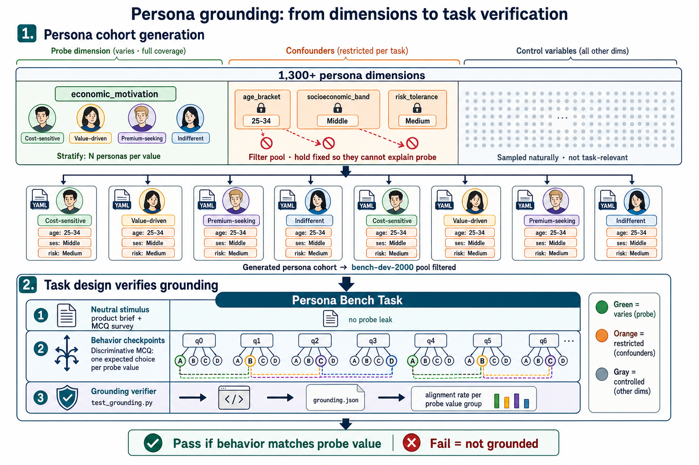

# PersonaBench Architecture

PersonaBench keeps team ownership separate from runtime plumbing. The public
contract is the three-module layout: `persona/`, `application/`, and
`environment/`.

## Persona Module

`persona/` owns the definition and evaluation of simulated people.

Expected contents:

- `persona/schema/` for dimensions, attribute definitions, validators, and
  schema docs.
- `persona/datasets/` for curated, small, reviewable persona sets.
- `persona/curation/` for scripts and manifests that build persona data.
- `persona/tasks/` for persona adherence and grounding tasks.
- `persona/reporting/` for analysis of persona quality and coverage.

Large raw dumps and generated outputs should not be committed unless they are
small, curated fixtures needed for tests or examples.

Persona grounding tasks use the persona dimensions to generate controlled
cohorts and verify that task behavior follows the selected probe value rather
than confounders:

## Application Module

`application/` owns scenarios where personas are used.

Expected contents:

- `application/tasks/` for runnable survey, chat, web, and product tasks (each
  task carries its own `reporting.json` policy).
- `application/scripts/` for application job generation and batch reporting
  rollups (`report_job.py` → `jobs/<job_name>/aggregation.json`).
- `application/playground/` for the Playground app/API/frontend plus survey,
  chatbot, and web evaluation helpers.

Applications should reference persona data through documented inputs instead of
copying persona datasets into application-specific folders.

## Environment Module

`environment/` owns execution.

Expected contents:

- `environment/runtime/harbor/` for job and trial execution, runtime models, verifier
  orchestration, CLI entrypoints, installed agents, and viewer backend APIs.
- `environment/agents/personabench/agents/` for PersonaBench-owned persona
  agent adapters and prompt templates.
- `configs/jobs/` for curated runnable Harbor job recipes.
- `environment/runtime/harbor/viewer/` for the viewer backend API.
- `apps/viewer/` for the viewer frontend source paired with `harbor view`.
- `environment/adapters/` for optional external benchmark adapters.

Persona agents live here because they are execution mechanisms. The persona
schema and datasets they consume live in `persona/`.

For execution planes, environment variables, contributor guidance, and the
Environment roadmap, see [environment/README.md](../environment/README.md).

## Shared Packages

`packages/` is for reusable libraries that serve multiple modules. If code is
only used by one module, keep it with that module.

## Import Policy

The MatrAIx migration PRs are provenance and raw material. Do not merge raw
snapshot directories into `main`. Each import PR should curate content into the
module that owns it and cite the source in the PR body.

Research notes migrated from MatrAIx live in `docs/research/`; they are working
references rather than a fully refreshed bibliography.
