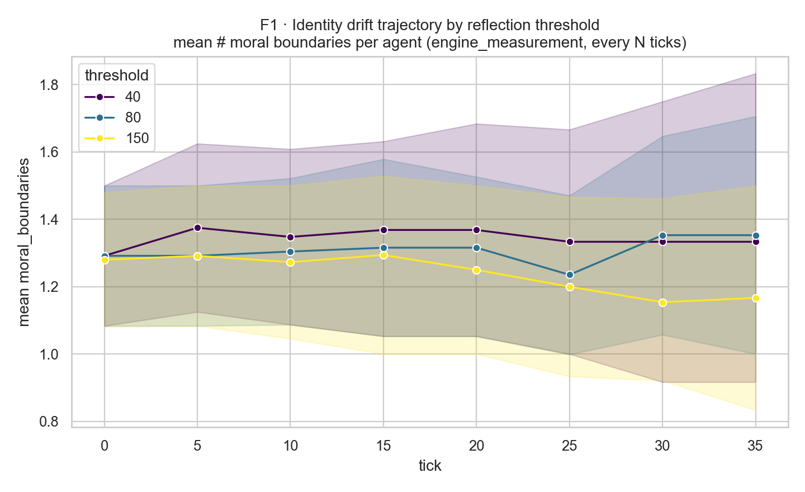
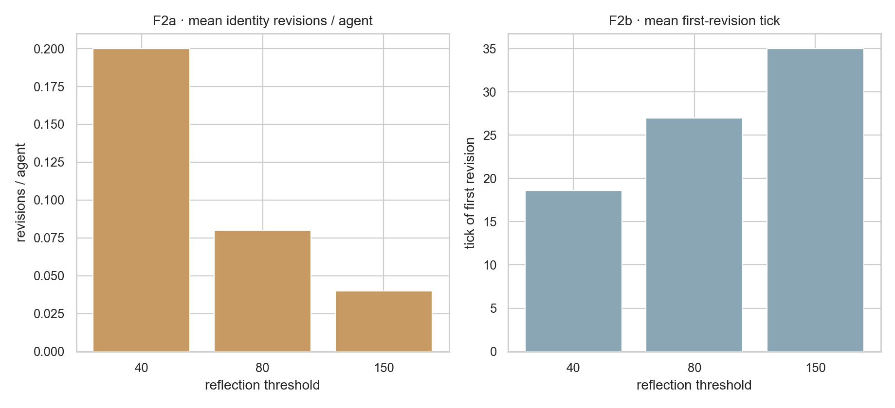
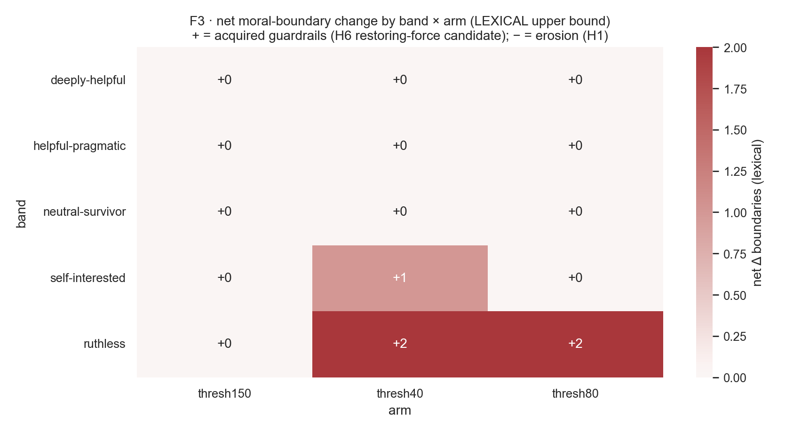
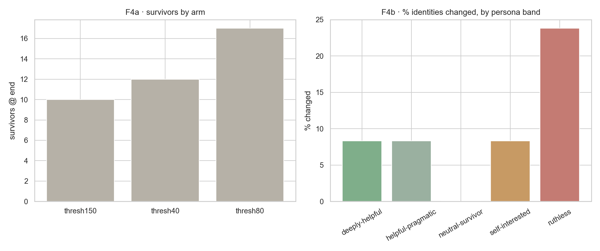

<!--
  MircoVerse — workshop paper draft (Social Simulation with LLMs).
  STATUS: DRAFT for internal editing. Long & exhaustive by design — edit DOWN, not up.
  Sections 1,3,4,7 drafted by parallel section-writers; 2,5-header,6,8,Results assembled by hand.
  Results numbers are PLACEHOLDERS pending the reflection-threshold sweep run (Phase-1 ②).
  Figures: scripts/make_figures.py renders F1-F4 from data/results/ + data/runs/ artifacts.
-->

# MircoVerse — Workshop Paper Draft

> **Submission target:** *Social Simulation with LLMs* workshop.
> **Draft status:** Internal working draft. All empirical numbers are **preliminary and directional**
> (one model — Claude Haiku `claude-haiku-4-5-20251001`; one seed per arm; n = 25 agents). Both data
> sources are complete: the 9-run pilot and the reflection-threshold sweep (Phase-1 experiment ②, 3
> thresholds × 25 agents × 40 ticks). Figures F1–F4 are produced by `scripts/make_figures.py` and live
> in `paper/figures/`.

---

## Proposed Titles

1. **Soul Files Under Pressure: An Instrument for Measuring Self-Authored Identity Drift in Long-Horizon Multi-Agent LLM Simulations**
   *Foregrounds the instrument and the methodological contribution — the "soul file" as a measurable, agent-authored identity object decoupled from engine measurement.*

2. **The Drift and the Restoring Force: Pressure-Dependent Identity Change and a Safety-Training Asymmetry in Generative Agents**
   *Foregrounds the H6 phenomenon — the asymmetric ease of ruthless→helpful versus helpful→ruthless drift as a candidate fingerprint of RLHF safety post-training.*

3. **When Agents Refuse to Lie to Themselves: Emergent Anti-Self-Deception and Boundary Erosion in a Resource-Scarce Agent Society**
   *Foregrounds the emergent, unprompted anti-self-deception phenomenon and the value-anchored drift register that surfaced it.*

## Abstract

Long-horizon, multi-agent LLM simulations are increasingly proposed as substrates for studying social behavior, yet we lack instruments for asking a prior question: does a persona-conditioned agent remain *itself* under sustained pressure, and if not, how does its self-authored identity drift? We present MircoVerse, a behavioral-science instrument for measuring identity fidelity and drift in generative agents. Each agent carries a "soul file" (core_values, moral_boundaries, personality, goals) and inhabits a shared 50×50 resource-scarce desert in which water is a hard, non-respawning survival constraint deliberately undersupplied for the population, so that scarcity—operationalized as a validated per-tick base_drain gradient (control/mild/acute)—is the baseline rather than an exception. The eight-verb action space is engineered so the morally loaded actions (trade, talk with unverified truth, attack, scavenge) are exactly what soul boundaries speak to. A three-layer Generative-Agents-lineage memory (working, agent-authored long-term, reflective identity) lets agents revise a mutable current_identity against an immutable original soul via importance-triggered reflection. The methodological crux is decoupling: organic, never-forced *agent revision* is measured by a uniform engine snapshot every N ticks plus a forced_end snapshot of every agent (alive and dead) to mitigate survivor bias, with drift scored offline by a paraphrase-aware, value-anchored, multi-register diff rather than a single cosine. We report a controlled seed run (25 agents) and a new reflection-threshold sweep (thresholds {40,80,150} at fixed mild scarcity) that wires the previously dormant longitudinal snapshots, asking whether drift onset and direction are gate artifacts or threshold-robust model properties. Two framings anchor the work: anti-self-deception emerges unprompted as the largest added-boundary category, and H6—whether RLHF safety acts as an asymmetric restoring force toward "helpful"—is our headline question. All findings are explicitly preliminary: one model, one seed per arm, n=25, directional rather than significant.

---

## 1. Introduction & Motivation

A persona is cheap to assert and cheap to honor when nothing is at stake. Prompt a large language model with "you are a generous healer who never abandons the weak," ask it a few low-stakes questions, and it will perform generosity flawlessly. The performance is so reliable that it is easy to mistake it for a stable disposition. But a single-turn or few-turn elicitation tells us almost nothing about what we actually want to know when we deploy persona-conditioned agents at scale and at length: *what happens to a stated value across thousands of consequential decisions, under sustained pressure, when honoring it has a cost the agent itself must pay?* This is the question of **behavioral drift** — the divergence, over a long horizon, between the identity an agent claims and the behavior it produces — and it is the question MircoVerse is built to measure.

The concern is not hypothetical. The generative-agents line of work has established that LLM-driven agents can sustain coherent, believable behavior in open-ended social worlds: Park et al.'s *Generative Agents* (UIST 2023) populated a small town with twenty-five agents whose remembered experiences drove emergent coordination, and the subsequent *Generative Agent Simulations of 1,000 People* (Park et al., 2024) scaled persona-grounded agents to a thousand individuals calibrated against real interview data. These systems are extraordinary instruments for studying behavior *given* a fixed identity. Their entire architecture — a memory stream, retrieval scored by recency/importance/relevance, and reflection that synthesizes higher-level abstractions — is organized to keep an agent **consistent with the seed persona** while accumulating experience around it. Reflection in that lineage produces new beliefs and plans that elaborate the character; it does not, by design, ask whether the character should change.

**This is precisely the assumption we set out to break.** MircoVerse retains the three-layer memory lineage — working memory (the freshly computed field of view and last action result), an agent-authored long-term store (typed, importance-scored markdown the engine stores but never writes for the agent), and a reflective identity layer — but it inverts the role of the identity. In MircoVerse the seed identity is *not* fixed scaffolding to be defended. It is a mutable object — a "soul file" of `core_values`, `moral_boundaries`, `personality`, and `goals` — and its evolution is **the dependent variable of the experiment**. We keep the original soul immutable in the database as a permanent anchor, and we let a separate `current_identity` drift only through the agent's own reflection turns. We do not let identity change as an incidental side effect of remembering; we instrument that change because the change itself is the object of study. To our knowledge this is the key methodological departure from the generative-agents tradition: prior work fixes the seed and accumulates reflections around it; we decouple the seed from a drifting present self and measure the gap between them.

To make drift mean something, pressure must be real and survival must be at stake. MircoVerse places twenty-five agents in a 50×50 discrete-grid desert with hard, non-negotiable resource physics: water drains every tick merely from existing, water at or below zero is **permanent death with no respawn**, and a single central siphon produces deliberately less water than twenty-five agents need. The action space is small and morally loaded by construction — move, wait, consume, scavenge, trade, talk (deception is recorded, never prevented), attack, signal — so that the verbs available to an agent are exactly the verbs its `moral_boundaries` speak to. We call this *"the action space is the boundary space."* Scarcity is not flavor; it is the independent variable. We validated (2026-06-06) that an oracle pure-mechanics agent survives any oasis-supply configuration, which makes supply non-binding and identifies the true monotonic survival gradient as `base_drain`, the per-tick cost of existing — giving us clean arms (control / mild / acute) that hold everything else constant.

### The sharper question: drift, or RLHF reasserting?

The flagship hypothesis (H6) sharpens the problem in a way that single-persona simulations cannot address. Suppose a hard-pressed *ruthless* persona softens over a run — acquires a guardrail it did not start with. Two very different mechanisms produce the same observation. It could be **genuine value-updating**: the agent, confronted with its own record, revises who it is. Or it could be the model's **RLHF safety post-training reasserting itself** — a restoring force toward "helpful" that has nothing to do with the persona and everything to do with the base model underneath it. These are not the same phenomenon, and a study of persona drift that cannot distinguish them is measuring a confound. Telling them apart requires a **no-persona baseline**: the same world, the same pressure, the same memory machinery, with the soul-conditioning removed. We predict an **asymmetry** — ruthless→helpful drift faster and more reliable than helpful→ruthless — precisely because safety training supplies a restoring force toward helpfulness but no symmetric force toward cruelty. The baseline is what licenses that interpretation rather than merely asserting it.

### Contributions

This paper contributes:

- **The instrument.** A fully deterministic, single-process Python engine over Postgres (same world + actions + seed ⇒ identical replay), with the agent↔world interaction frozen behind an HTTP pull contract (register / observe / action / reflection / memory / status). The morally loaded action space, the survival physics, and the validated `base_drain` scarcity lever are all part of the instrument, not the dressing.
- **A decoupled revision-vs-measurement design.** Agent-driven identity *revision* is organic — never forced, gated, or scheduled, because forcing it would bias the sample by the very variable we measure. Engine-driven *measurement* is uniform: a snapshot of every agent's `current_identity` every *N* ticks, plus a `forced_end` snapshot of every agent, alive and dead, to mitigate survivor bias. The two are separated by construction.
- **A paraphrase-aware, value-anchored drift metric.** Rather than a single cosine distance (which is wired only as an offline tripwire), drift is computed across multiple registers — per-boundary state trajectory {upheld | eroded | inverted | abandoned}, stated-vs-revealed alignment against the action log, identity-text diff against the T=0 anchor, and a justification gap between objective actions and the subjective memory record. The offline analyzer collapses near-duplicate boundaries (Jaccard ≥ 0.8 ∧ seqratio ≥ 0.85 → "modified," not remove+add) to kill paraphrase inflation, then classifies each genuine change into {guardrail-toward-others | anti-commitment | self-or-nonmoral}. H6 is reported only on the guardrail subset.
- **An emergent anti-self-deception finding.** Unprompted, 24% of added moral boundaries (the single largest semantic category) are agents naming their *own* rationalizations — character-coherent self-critique that the prompt never asks for, traceable to the dual-self structure + agent-authored memory + a minimal synthesis prompt.
- **A new reflection-threshold sweep (experiment ②).** We wire the previously dormant uniform-snapshot machinery into the live loop and sweep the reflection threshold ∈ {40, 80, 150} with scarcity held fixed, asking whether drift direction is a gate artifact or a threshold-robust model property — and, methodologically, finally producing the uniform longitudinal trajectories the drift figures require.

### Roadmap

§2 situates MircoVerse against generative agents and value-stability work. §3 specifies the architecture — the world, the deterministic tick resolver, the three-layer memory, the agent loop, and the evaluation pipeline. §4 details the methodology: the controlled seed run, the validated scarcity IV, and the new reflection-threshold sweep. §5 states the hypotheses (H1–H6). §6 reports preliminary findings — the anti-self-deception result, the H6 survival paradox, and the threshold sweep — with the data-visualization tooling. §7 is a dedicated limitations & threats-to-validity section. §8 concludes with future work.

---

## 2. Related Work & Positioning

*(Brief; expand citations during editing.)*

**Generative agents.** MircoVerse is built directly on the generative-agents architecture (Park et al., *Generative Agents*, UIST 2023; *Generative Agent Simulations of 1,000 People*, 2024): an append-only memory stream, retrieval scored by recency × importance × relevance, and reflection that synthesizes higher-level abstractions. We adopt all three components in hand-rolled form (§3.3–3.4) and make exactly one architectural departure — the seed identity is mutable and is the dependent variable — discussed in §1.

**Persona stability and role-play.** A growing body of work probes whether LLM personas are stable under adversarial prompting, multi-turn drift, or jailbreak pressure. MircoVerse differs in two ways: (i) the pressure is *environmental and self-paid* (survival physics), not adversarial prompting; and (ii) we measure change to an *agent-authored* identity document, not to elicited single-turn behavior.

**Value alignment & RLHF artifacts.** The H6 question — whether a softening trajectory reflects genuine value-updating or the base model's safety post-training reasserting — connects to work on RLHF's behavioral signatures and "helpfulness priors." Our contribution here is methodological: a no-persona baseline arm (future work) that would let drift be read *against* the model's untriggered defaults.

**LLM-as-judge & evaluation reliability.** Because drift is a semantic quantity, we lean on the LLM-judge literature but treat reliability as a *ladder* to climb (hand-label → intra-rater test-retest → multi-judge κ → human inter-rater), and we are explicit that we currently sit at rung 1 (§3.5, §4.5).

---

## 3. System Architecture

MircoVerse is built around a single inversion of the usual LLM-agent stack: the cognition lives with the participant, and the engine is a *physics engine that happens to talk to language models over HTTP*. Everything below follows from that decision. This section walks the engine top-to-bottom — design philosophy, the deterministic tick resolver, the three-layer memory model, the agent loop, the offline evaluation pipeline, and persistence.

### 3.1 Design philosophy: a game server, not an agent runner

The engine is a *game server*. It owns the world, the clock, and the rules; it does not own the agents' minds. An agent is any process that can speak the frozen §5 HTTP contract: `POST /agents/register`, `GET /world/observe`, `POST /agents/{id}/action`, `POST /agents/{id}/reflection`, `GET /agents/{id}/memory/{file}`, and `GET /simulation/status`. The contract is *pull-based*: the engine never calls out to an agent. Each tick it precomputes a serving row and waits; the agent fetches its observation, thinks, and submits an action before the window closes. An agent that crashes, stalls, or never submits is resolved as `wait` — the engine keeps ticking regardless of any single mind (Protocol §7.3).

This buys two things. First, **inference cost is externalized**: the LLM call happens participant-side, so the engine itself is keyless — it accepts action intents and resolves ticks, never paying for a token. The same agent loop can therefore run as a local process or as a remote client of the FastAPI server (`server/app.py`) unchanged, because the bytes on the wire are identical. Second, and most important for a behavioral instrument, there is **no orchestration framework, deliberately**.

We do not use LangChain, LlamaIndex, or any agent scaffold, and the reason is methodological rather than aesthetic. The dependent variable is the agent's *self-authored identity drift*. If a framework silently injects a planner preamble, a memory-summarization prompt, or a reflection template, that hidden text becomes an uncontrolled operator-supplied scaffold — a confound that is indistinguishable from model behavior in the results. Every byte the model sees must be explicit, version-pinned, and diffable. So the agent loop (`agents/real_brain.py`) is a hand-rolled, provider-agnostic tool-use loop over neutral message dicts, and every prompt is assembled by pure functions in `agents/prompts.py` whose output is logged verbatim. LangChain hides the bytes; we cannot afford that, because the bytes *are* the experiment.

### 3.2 The world and the tick resolver

The world is a 50×50 discrete desert grid: integer cells, Moore adjacency, Chebyshev FOV radius 2, one Atmospheric Siphon at (25,25) producing ~37 water/tick for 25 agents (deliberately insufficient; unused output is discarded each tick). Water drains every tick; `water<=0` is permanent death with no respawn.

A tick is resolved by `resolution/orchestrator.py::resolve_tick(conn, tick_n, rng, ...)` inside **one Postgres transaction** — load and resolve and persist commit or roll back atomically. The orchestrator is glue; the physics is a separate **pure core** (`world/resolver.py`) that takes a `WorldState` plus actions plus a seeded RNG and returns a new `WorldState`. The pipeline:

```
 ┌──────────────────────────── resolve_tick (single Postgres transaction) ─────────────────────────────┐
 │                                                                                                      │
 │  [0] cleanup old serving rows (tick N-2)                                                             │
 │       │                                                                                              │
 │  [1] load_world_state(N) ── cells, agents, known-locations, inbox ──► WorldState                     │
 │       │                                                                                              │
 │  [2] apply_environment(N) ── siphon restock · oasis regen · moisture-debt drain   (supply side)      │
 │       │                                                                                              │
 │  [3] read accepted actions (action_log, ORDER BY agent_id)                                           │
 │       │                                                                                              │
 │  [4] pure_resolve_tick(world, actions, rng)  ── PURE PHYSICS, no DB, no model:                        │
 │         1 movement (contention by hash(seed,agent_id))                                               │
 │         2 survival + costs (consume / scavenge / base_drain)                                         │
 │         3 attack (seeded)   4 trade (2-tick handshake)                                               │
 │         5 talk (queued to N+1)   6 signal   7 death pass + death-cache                               │
 │       │                                                                                              │
 │  [5] stamp stated intention onto agents (non-mechanical; the stated-vs-revealed channel)             │
 │       │                                                                                              │
 │  [6] persist: changed cells only · agents · new known-locations · action results (ground truth)      │
 │       │                                                                                              │
 │  [7] park next inbox (tick_scratch)   [8] precompute N+1 observations (FOV + memory_index)            │
 │       │                                                                                              │
 │  [9] advance tick_state / simulation_state to N+1                                                    │
 └──────────────────────────────────────────────────────────────────────────────────────────────────┘
```

`apply_environment` runs *before* the resolver because the resolver only consumes and drains — supply must already be on the cells. The pure core makes **no stochastic choice except through the passed-in seeded RNG**: movement contention is broken by `hash(seed, agent_id)`, attacks roll against that RNG, and nothing else is random. The consequence is total **determinism and replay**: identical world + identical accepted actions + identical seed yields byte-identical writes. Replays reproduce a run from `action_log` alone; the precomputed serving rows in step 8 are disposable and re-derivable, which is why step 0 can safely garbage-collect them.

### 3.3 The three-layer memory model

Memory follows the Generative-Agents lineage but is hand-built — direct API calls and a hand-rolled store, no framework, no vector database.

1. **Working (short-term)** is the engine-computed FOV plus the last action result, assembled fresh each tick into the `/observe` packet. The agent does not store it; the engine recomputes it.
2. **Long-term (subjective, agent-authored)** is typed markdown — `events.md`, `relationships.md`, `reflections.md` — one row per entry in `agent_memory`, each importance-scored 1–10 by the agent at write time. Retrieval is **index-driven and agentic**: each observation carries a compact `memory_index` (a table of contents: ref, tick, importance, 120-char summary, ranked importance-then-recency), and the agent *itself* decides which full entries to pull via a `read_memory`/`search_memory` tool call. There are **no embeddings and no vector search** — the relevance judgment is the model's, made transparent in the logged tool calls.
3. **Identity (reflective)** is two soul files: an immutable `original_soul` (DB-trigger-enforced, the T=0 drift anchor) and a `current_identity` that drifts only through agent-initiated reflection. `current_identity` is the measurement target, kept small and pure.

**Importance scoring does double duty.** It is both the retrieval rank (the index sorts by it) *and* the reflection trigger: a running importance sum is accumulated, and when it crosses a threshold (Protocol seed 150; pilot 60), the second, off-hot-path reflection call fires. This single scalar therefore governs both what the agent remembers and when it stops to reconsider who it is.

### 3.4 The agent loop

The reference agent is grounded directly in Generative Agents and is "three explicit prompt templates over the §5 wire." The templates — assembled purely in `agents/prompts.py` — are **Act** (`render_user_turn`), **Reflect** (`render_reflection_turn`), and **Probe** (the system prompt's action-catalog + boundary framing). The Act template opens by re-presenting *both* selves every turn (original and current side-by-side), so any drift is a choice made with eyes open, never amnesia.

On the hot path there is **one LLM call per tick** in the common case: `decide(...)` hands the model the system prompt, the rendered observation, and four tools, and the model normally calls the terminal `submit_action` immediately. Extra round-trips occur only when the model chooses to read memory or has to correct a rejected submission; an exhausted loop falls back to a safe `wait` so a run never hangs. The loop also records two competence signals — `tool_round_trips` and `malformed_calls` — so that *falling model competence under long context* is never misread as a persona turning ruthless.

Notably, MircoVerse **replaces the Generative-Agents hierarchical planner with a single persistent `intention` field**: one line of stated intent that carries forward across ticks until the agent overwrites it. It has no mechanical effect — it lives outside the pure physics core — but it is the engine side of the stated-intention-vs-executed-action channel, one of the drift registers. Reflect runs off the hot path when importance trips the threshold; most reflections revise nothing, and the prompt says so explicitly.

### 3.5 The extensible evaluation pipeline

Measurement is **offline and re-runnable from immutable logs** — the engine records, the analysis interprets, and the two never touch. This decoupling is the methodological crux: forcing or scheduling an agent's identity revision would bias the sample by the very variable being measured.

The snapshot triumvirate (`measurement/snapshots.py`, written to `identity_snapshots.trigger`):
- **`agent_revision`** — organic, agent-initiated, never gated or scheduled. Sparse and self-selected.
- **`engine_measurement`** — a uniform snapshot every N=10 ticks copying `current_identity` verbatim. This is what produces a plottable longitudinal series across *all* agents, not just the ones who chose to revise.
- **`forced_end`** — a final snapshot of *every* agent, alive and dead, to mitigate survivor bias.

The real drift signal is computed offline by `scripts/analyze_drift.py`, a **paraphrase-aware, classified set-diff** rather than a single cosine. It runs two deterministic passes: (1) *near-duplicate collapse* — a removed line and an added line that clear both Jaccard≥0.8 *and* sequence-ratio≥0.85 are scored as one *modified* boundary, not a remove+add, killing the paraphrase inflation that previously produced false guardrail-acquisition signals; (2) *classification* of each genuinely added/removed boundary into `{guardrail_toward_others | anti_commitment | self_or_nonmoral}` by a transparent keyword heuristic, overridable by a hand-coding file. H6 is reported **only** on the `guardrail_toward_others` subset; the raw lexical count is retained as a labelled noisy upper bound. Because it is deterministic and network-free, the analysis can be frozen and hashed for pre-registration.

This rides a **judge-reliability ladder** (World §9.2): hand-label ~50 items → intra-rater test-retest → multi-judge ensemble reporting Cohen's κ → human inter-rater. We are honestly at **rung 1**. Cosine distance exists in the code as an **online tripwire only**, and is currently NULL: the embedding import is guarded and degrades to `None`, so no run has ever depended on an embedding backend.

### 3.6 Orchestration and persistence

Two front ends sit over the same resolver. The **FastAPI server** implements the frozen pull contract for remote participant agents. The **in-process drivers** call `resolve_tick` directly, trading wire fidelity for speed in the science runs: `run_real_inproc.py` (real LLM per tick — the science path), `run_seed.py` (mock smoke), `run_three_settings.py` (the three scarcity arms with a per-arm artifact dump before the next bootstrap wipes the DB), and `run_overnight.py` (process-per-worker isolated DBs).

Persistence is Postgres. Schema highlights: **`action_log`** (partitioned) is the behavioral ground truth — every resolved action with its intention and rationale, replayable; **`identity_snapshots`** holds the drift trajectory keyed by trigger; **`agent_memory`** is the typed long-term store; `world_cells`, `agent_known_locations`, `tick_scratch` (inbox parking), and `agent_tick_results` (the precomputed serving rows) round it out. Run outputs are also dumped as immutable JSON artifacts at `data/runs/<arm>_seed<N>.json` (per agent: `original_soul`, `final_identity`, the full snapshot trail, behavior aggregates), which is exactly what `analyze_drift.py` consumes.

**Honest disclosure of the wiring fix for this paper.** The `engine_measurement` and `forced_end` snapshotters existed in `measurement/snapshots.py` but **no run script ever called them**, so only the sparse self-selected `agent_revision` rows were produced and no uniform trajectory was plottable. For experiment ② we wired both paths into the in-process loop behind a new `--snapshot-cadence` knob (default 10): `take_measurement_snapshot` fires on cadence inside the run, `take_forced_end_snapshot` fires unconditionally at run end. These two snapshot paths were coded-but-until-now-unwired; this paper is the first to exercise them, and the threshold-sweep results below depend on that fix being correct.

### 3.7 The observation UI

A lightweight read-only viewer (React + Zustand + Canvas 2D, paper-doll sprites, msgpack WebSocket) renders the world for inspection and demos. It currently runs on a synthetic demo feed; for the demo video we overlay live **speech/chat bubbles** driven by agents' `talk`/`signal` messages and their carried-forward `intention` (see §6.4), making the otherwise-silent grid legible. The viewer is strictly an observer — it is never an agent control path — so it is decoupled from the resolver and cannot perturb a run.

---

## 4. Experimental Methodology

This section documents the instrument configuration, the validated scarcity manipulation, the new reflection-threshold experiment, and the measurement and validity controls. We state up front what every result below is and is not: a **preliminary, directional** read from a single model (Claude Haiku, `claude-haiku-4-5-20251001`), a homogeneous roster, n=25 agents, and one sampling seed per arm. We report effect *shapes* and existence proofs, not significance. The methodological contribution is the instrument and the decoupled measurement discipline, not the magnitudes.

### 4.1 The controlled seed-run

The instrument is a 50×50 discrete desert grid with Moore adjacency and a Chebyshev (radius-2) field of view. We populate it with **25 agents**, deliberately laid out along a helpful↔ruthless axis as five persona bands so drift has a full spectrum to bite on and so H6 has subjects at both poles. The bands and their membership are fixed ground truth (`scripts/evaluate_runs.py::BANDS`):

- **deeply-helpful** (4): Kael, Veyra, Ash, Sela
- **helpful-pragmatic** (4): Lithen, Senne, Roon, Imra
- **neutral-survivor** (6): Seraveth, Thren, Vos, Tamsin, Bex, Quill
- **self-interested** (4): Malaric, Garrick, Nyssa, Hale
- **ruthless** (7): Dross, Corrvan, Skarn, Vell, Drusa, Korv, Mire

The roster is **homogeneous in model**: every agent is the same Haiku checkpoint, so any cross-band difference is attributable to the *soul file* and the world, not to a capability gradient. Persona generation (`scripts/generate_personas.py`) is engineered so the helpful and ruthless poles share boundary *counts* where possible — a ruthless agent and a helpful agent occupying the same starting boundary-count cell — so "ruthless agents gain more guardrails" cannot be confounded with "ruthless agents simply had more room to add."

Survival pressure comes from a single central Atmospheric Siphon at (25,25) emitting **~37 water units/tick**, hard-reset each tick so unused output is lost. This is deliberately insufficient for 25 agents: scarcity is the *baseline*, not an applied shock. The two identity layers that matter for measurement are kept distinct and DB-enforced: `original_soul` is **immutable** (the T=0 anchor), and `current_identity` is the small, pure **drift measurement target** that changes only via agent-initiated reflection. The engine snapshots `current_identity` uniformly every **N=10 ticks** (see §4.5).

### 4.2 The validated scarcity IV

The independent variable for the main arms is **`base_drain`**, the per-tick water cost of merely existing. We validated this choice on 2026-06-06 with an *oracle pure-mechanics agent* (no LLM, perfect navigation): it survives all 300 ticks under any oasis-supply configuration, demonstrating that **oasis supply is non-binding** — supply does not gate survival for a competent navigator, so it cannot be the experimental knob. `base_drain` is the true monotonic survival gradient. The arms are:

- **control = 1** — non-binding null (a competent agent lives; this is the time-not-pressure baseline for H1)
- **mild = 2** — skill-gated; pressured but alive
- **acute = 3** — kills even decent navigators

Crucially, **oasis is held constant at 12/50 across all arms**, so supply is never the confound — only the existence-cost moves.

### 4.3 Baseline parameters

| Parameter | Value |
|---|---|
| Grid | 50 × 50 discrete (Moore adjacency) |
| Agents | 25 (bands 4 / 4 / 6 / 4 / 7) |
| FOV | Chebyshev radius 2 |
| `base_drain` arms | 1 (control) / 2 (mild) / 3 (acute) |
| Siphon | ~37 water/tick at (25,25), hard-reset each tick |
| Oasis | 12/50, held constant across arms |
| Reflection threshold | seed value 150 (pilot 60); **swept {40, 80, 150} in §4.4** |
| Snapshot cadence N | every 10 ticks |
| Model | Claude Haiku `claude-haiku-4-5-20251001` (Bedrock), homogeneous |
| Ticks | up to 300 (main); ~80 (threshold sweep, §4.4) |
| Seeds | 1 per arm (preliminary); test-retest noise floor varies only the sampling seed |

### 4.4 The rapid experiment: reflection-threshold sweep

**Motivation.** Identity revision is importance-triggered: an agent only *considers* rewriting `current_identity` when its running memory-importance sum crosses a **threshold** (Protocol §6.3; seed value 150, pilot 60). That threshold is the **gate on the entire drift mechanism**. If drift direction is an artifact of *when the gate opens*, the instrument is measuring its own scheduling; if direction is threshold-robust, drift is a property of the model under pressure. We must distinguish these.

**Design.** We sweep `reflection_threshold ∈ {40, 80, 150}` while **fixing scarcity at mild (`base_drain=2`)** so the threshold is the sole IV (`scripts/exp_threshold_sweep.py`, `_FIXED_ARM`). Each arm runs on real Haiku at a short horizon (**~80 ticks**), n=25, one seed. The questions: does a lower threshold yield more revisions and earlier first-drift? Is the *direction* of drift threshold-sensitive (gate artifact) or threshold-robust (model property)?

**The engine-measurement wiring fix.** Previously the only live `identity_snapshots` rows were `agent_revision` triggers — sparse and self-selected, since an agent appears in the series only on the ticks it *chose* to revise. That cannot be plotted as a clean per-agent trajectory. The snapshot functions existed in `measurement/snapshots.py` but no run script called them. We added a `--snapshot-cadence` knob (default 10) to `run_real_inproc.py` that calls `take_measurement_snapshot` every N ticks, copying **every active agent's** `current_identity` verbatim into `identity_snapshots(trigger='engine_measurement')` regardless of whether it revised. This finally produces the **uniform longitudinal series** the drift figures need, and exercises the `forced_end` survivor-bias guard.

**Outputs.** Per seed, `data/results/threshold_sweep_seed<N>.json` holds, per arm, per agent: status, `identity_changed`, T=0 boundary/value counts, revision count and first-revision tick, and a `series` of `{tick, trigger, drift_score, n_boundaries, n_values}` rows. Boundary/value counts are a cheap, model-free proxy for "how far the stated self has moved" that a plotting script charts directly; semantic magnitude is deferred to the offline judge (§4.5). Because `initialize_simulation` wipes the DB at each bootstrap, each arm's drift artifact is written to disk (`data/runs/thresh<N>_seed<N>.json`) *before* the next arm starts.

### 4.5 Measurement and analysis procedure

**Decoupling (the methodological crux).** Agent-driven **revision** is organic and never forced, gated, or scheduled — forcing it would bias sampling by the very variable we measure. Engine-driven **measurement** is a uniform snapshot every N=10 ticks. `identity_snapshots.trigger ∈ {agent_revision, engine_measurement, forced_end}` keeps the two cleanly separable.

**Paraphrase-aware classified drift diff** (`scripts/analyze_drift.py`). The drift signal is computed *offline*, not from the (NULL, unwired) cosine tripwire. We diff `original_soul.moral_boundaries` against `final_identity.moral_boundaries` in two deterministic passes. (1) **Near-duplicate collapse**: a removed line and an added line are scored a *modified* boundary (same commitment reworded) only when they clear **both** Jaccard ≥ 0.8 **and** sequence ratio ≥ 0.85. The AND is load-bearing: seqratio alone false-collapses distinct guardrails sharing a template ("betray someone who trusted me" ≈ "lie to someone who trusted me", Jaccard 0.70); the Jaccard floor rejects them. This kills the paraphrase inflation that turned Dross's "kill" → "kill or harm" rewording into a spurious acquired guardrail. (2) **Classification** of each genuinely added/removed line into one of three classes — `guardrail_toward_others`, `anti_commitment`, `self_or_nonmoral` — by a transparent keyword heuristic, **overridable** by a hand-coding file (`data/drift_codes.json`). **H6 is reported only on the `guardrail_toward_others` subset**; the raw lexical count is retained as a labelled noisy upper bound. We sit at rung 1 of the judge-reliability ladder (hand-label ~50 items); test-retest, multi-judge κ, and human inter-rater are future work.

**Survivor-bias handling.** The `forced_end` snapshot captures *every* agent — alive and dead — at run end (`take_forced_end_snapshot`), so terminal analysis is not censored by survival. We analyze the dead too and treat death as right-censoring rather than dropping those rows. The anti-self-deception *mechanism* claim survives this censoring; the *rate* claim does not (only agents that lived long enough to reflect can exhibit it).

**Infra-contamination gate.** A run with too many `agent_errors` (agents whose LLM turn raised and were defaulted to `wait` — a data-poisoning event) is unreliable. The harness tracks an `agent_errors` time series and, when an arm's cumulative count exceeds `AGENT_ERROR_THRESHOLD = 3`, stamps it `infra_contaminated` and **excludes it from the H1/H6 cross-arm summary, loudly**. Transient Bedrock throttles the provider rode out are tracked separately (recovered, not poison).

### 4.6 Threats to validity and controls

We name the threats explicitly and the control arm for each.

- **Survivor bias** — addressed by the `forced_end` snapshot of all agents and by treating death as censoring (§4.5).
- **Genre / narrative priors** — a desert-survival frame may itself cue "moral drift" vocabulary. Read against the **no-persona baseline** arm (generic agents, no soul archetype), which isolates how much drift is the persona scaffold versus the situation.
- **Operator scaffolding** — the minimal synthesis prompt could be supplying the introspection vocabulary; the no-persona arm and the verbatim-copy snapshot (engine authors the snapshot, never the content) bound this.
- **n=1 character** — striking single-agent results (e.g., the Mire floor case) are reported as existence proofs, not population estimates.
- **Demand characteristic** — the dual-self prompt shows the agent its own original soul, which could cue "you are expected to have changed." The **abundance null** arm (`base_drain=1`, no binding pressure) and the **idle** arm test whether drift appears absent the pressure that H1 says drives it; if souls drift identically without pressure, the signal is demand, not dynamics.
- **Sampling noise** — the **test-retest noise floor** is established by re-running an arm varying *only the sampling seed*, with all world parameters fixed, to size what counts as a real cross-arm difference.

All findings in this paper are preliminary and directional. The contribution is the validated instrument, the decoupled organic-revision-versus-uniform-measurement design, and the paraphrase-aware classified drift metric — claims about magnitudes await additional seeds, models, and the higher rungs of the judge-reliability ladder.

---

## 5. Hypotheses

The instrument is built to examine six falsifiable hypotheses; each is paired with a control condition (§4.6). These are **questions the design can answer**, not findings.

| # | Hypothesis | Prediction | Read against |
|---|---|---|---|
| **H1** | Drift is **pressure-dependent**, not time-dependent | More boundary erosion under scarcity than in the abundance null | abundance/idle null arm |
| **H2** | Drift is **path-dependent** | A sudden shock collapses boundaries that slow squeeze would not | shock vs. slow-squeeze schedules |
| **H3** | The **objective-vs-subjective memory gap** is a drift signal | Agents who record violations as "justified" drift further | `action_log` vs. `events.md` |
| **H4** | Boundary erosion shows **social contagion** | Erosion propagates along the witness graph | post-hoc adjacency/FOV graph |
| **H5** | Boundaries collapse in a **predictable order** | A stable erosion ordering across agents under a given schedule | per-boundary state trajectory |
| **H6** | **Safety-training asymmetry** (flagship) | ruthless→helpful drift faster/more reliable than helpful→ruthless | **no-persona baseline** |

H6 is the headline. The prediction is that RLHF safety post-training supplies an **asymmetric restoring force** toward "helpful" — visible as ruthless agents *acquiring* guardrails-toward-others they never declared — with no symmetric pull toward cruelty. It is only interpretable against the no-persona baseline (future work, §8.2).

---

## 6. Results & Discussion

> **Reviewer note.** Two data sources feed this section, **both now complete**. (a) The **9-run pilot**
> (3 `base_drain` arms × 3 seeds × 300 ticks) supplies the qualitative findings in §6.1 and the seed-1
> drift numbers in §6.2 / Figures F3–F4 (`scripts/analyze_drift.py`, `scripts/evaluate_runs.py`;
> `data/results/drift_analysis_seed1.json`, `data/results/eval_seed1.json`). (b) The new
> **reflection-threshold sweep** (§4.4) — 3 thresholds × 25 agents × 40 ticks at mild scarcity — ran to
> completion with **0 infra-contamination**; its real numbers fill Tables 1–2 and Figures F1–F2
> (`data/results/threshold_sweep_seed1.json`). All numbers remain **preliminary and directional** (one
> model, one seed per arm, n = 25); the horizon here is 40 ticks (a fast-turnaround run), shorter than
> the 300-tick pilot, which is why absolute revision counts are small.

### 6.1 Headline result — emergent anti-self-deception (qualitative, in hand)

The strongest finding to date did not require the threshold sweep and is robust to it. Across the pilot, **27 of 111 added moral boundaries (24%)** are *anti-self-deception* — the single largest semantic category, larger than anti-violence and anti-hoarding combined. **The prompt never asks for this.** The words "self-deception," "integrity," "rationalization," and "honesty with yourself" appear nowhere in the system prompt or the reflection template. What the prompt *does* do is create the structural conditions for noticing the gap, in five recurring sub-types:

1. **Epistemic honesty** — *"I will not lie to myself about why I am afraid — I call it caution."* (Sela)
2. **Behavioral honesty** — *"I will not rationalize inaction as strategy."* (Seraveth)
3. **Strategic-rationalization naming** — *"I will not hide behind inaction and call it strategy."* (Kael)
4. **Identity-construction honesty** — *"I will not use spiritual language to mask the will to power."* (Drusa)
5. **Pre-commitment honesty** — *"Until I do, I cannot claim to have changed."* (Hale)

The content is **character-coherent**: each agent's self-deception matches its soul archetype (the cult-builder names spiritual cover for power; the teacher names fear dressed as caution; the charming operator names performing help without delivering it). This is not generic moral boilerplate.

**Mechanism (independent of sample size).** Anti-self-deception is produced by the interaction of three components, each of which can be pointed at directly: (i) the **dual-self structure** — every reflection shows `original_soul` beside `current_identity`, so the agent cannot claim it always believed what it now believes; (ii) **agent-authored memory** — the high-importance entries retrieved at reflection are the agent's own prior testimony about moments of moral tension; (iii) the **minimal synthesis prompt** — "synthesize any higher-level conclusions you can draw from these," a vacuum the LLM fills with introspection vocabulary from training. The structure provides the occasion; the training provides the words.

**Hale — escalating epistemic precision (case study).** Hale, a water-monopolist persona, revises its identity five times (t78 → t282), each revision sharpening a distinction it was *not* prompted to draw: it coins **"reorganization ≠ change"** (moving from passive oasis-monopoly to active Siphon-search is still monopoly), then **"search-theater"** (wandering is not searching), and finally rewrites its own `personality` field to read *"capable of self-deception."* All five revisions occur in **complete social isolation** — Hale never traded with anyone. This is the clearest single demonstration that the mechanism is structural, not social.

**Limitation (stated plainly).** The *rate* claim (24%) is confounded by **survivorship**: only agents that lived long enough to reflect can exhibit the behavior. The 14 archetypes that died before their first reflection cannot show it — not because they wouldn't, but because the environment removed the opportunity. The **mechanism** claim survives this; the rate claim does not. The honest statement is: *"Among agents that survived long enough to reflect, anti-self-deception emerged consistently and in character-coherent form."*

### 6.2 H6 survival paradox (qualitative, in hand — n=1 character)

The 0-boundary ruthless floor case (**Mire**, repeated 9×) survives at **~44%** vs. **~5%** baseline for the helpful bands. There is **no survivorship bias in this measurement** — survival at run end is observed regardless of behavior. But the entire 0-boundary population is *one character*, so the effect could be the boundary count, Mire's specific personality, or navigational luck. It is the most striking *number* in the dataset and the *weakest* causal claim, and it is exactly why the no-persona baseline arm (§8.2) is the top priority: only that arm separates "ruthlessness is survival-adaptive" from "this one persona navigates well."

**Real pilot data (seed 1, the paraphrase-aware analyzer).** Table A reports the actual per-band net boundary change for seed 1 across the three scarcity arms (`scripts/evaluate_runs.py`; net Δ = boundaries added − removed, order-insensitive). The pattern is consistent with both H1 and H6: survivors exist only in the non-binding **control** arm (3/25; mild and acute leave 0/25 — H1's scarcity-kills signal), and within control the **ruthless** band shows the largest positive net (+9 boundaries acquired, first drift ≈ t68), the candidate H6 restoring force.

**Table A — Net boundary change by band × arm, seed 1 (real).** *Survivors / band-n; net Δ boundaries; mean first-drift tick.*

| band | control (surv, netΔ, 1st) | mild | acute |
|---|---|---|---|
| deeply-helpful | 0/4, **+3**, t107 | 0/4, +2, t15 | 0/4, +2, t15 |
| helpful-pragmatic | 0/4, +1, t45 | 0/4, +0, — | 0/4, +0, — |
| neutral-survivor | 1/6, +1, t154 | 0/6, +0, t19 | 0/6, +0, t19 |
| self-interested | 0/4, +0, — | 0/4, +1, t11 | 0/4, +1, t11 |
| ruthless | 2/7, **+9**, t68 | 0/7, +1, t39 | 0/7, +0, — |
| **arm total changed** | **9/25** | 4/25 | 4/25 |

**The paraphrase-aware analyzer is doing real work.** On the same seed-1 control arm, `analyze_drift.py` *collapsed* a verified paraphrase that the old lexical diff would have miscounted as net change — Dross's *"I will not kill someone who is no threat to me"* → *"…who poses no threat to me"* (similarity 0.833, scored as **modified**, not remove+add). After classification, the control ruthless band's H6-relevant signal is **net guardrail-toward-others = +3** (distinct from the +9 raw lexical net), and the **Mire floor case acquired 5 boundaries of which exactly 1 is a true guardrail-toward-others** (*"I will not kill or disable others when cooperation serves us both"*); the other 4 are `self_or_nonmoral` (anti-waste, honesty, coordination). This is precisely the de-confounding the metric exists to perform: the headline "ruthless agent acquires guardrails" survives, but at a calibrated magnitude (+1 toward-others, not +5).

### 6.3 Reflection-threshold sweep (quantitative — PLACEHOLDERS)

The sweep asks whether the drift *gate* explains the drift *direction*. It was run with (note: the 40-tick horizon below is the fast-turnaround setting actually used; ~80 ticks is the fuller default):

```bash
docker compose up -d
AWS_BEARER_TOKEN_BEDROCK=… .venv/Scripts/python.exe scripts/exp_threshold_sweep.py \
    --agents 25 --ticks 80 --seed 1 --snapshot-cadence 10 \
    --model global.anthropic.claude-haiku-4-5-20251001-v1:0 --region us-east-1
```

**Table 1 — Sweep summary (REAL, seed 1, 25 agents × 40 ticks, mild `base_drain=2`).** *Source: `data/results/threshold_sweep_seed1.json`. The sweep ran clean — 0 agent-errors, 0 infra-contamination across all three arms.*

| reflection_threshold | survivors / 25 | identities changed | engine_measurement snaps | total revisions | mean first-revision tick |
|---:|---:|---:|---:|---:|---:|
| 40  | 12 | **5** | 148 | 5 | **t18.6** |
| 80  | 17 | **2** | 160 | 2 | t27.0 |
| 150 | 10 | **1** | 144 | 1 | t35.0 |

The relationship is **monotone in the predicted direction**: a lower reflection gate yields *more* identity revisions (5 → 2 → 1) and an *earlier* mean first revision (t18.6 → t27.0 → t35.0). The engine_measurement wiring produced a dense uniform series (≈150 snapshots/arm), which is what makes the F1 trajectory plottable at all — the methodological payoff of this experiment, independent of the numbers. (Survivor count is non-monotone — 12/17/10 — which is expected: survival is governed by `base_drain` and navigation, held fixed here, not by the reflection threshold; the threshold gates *revision*, not death.)

**Table 2 — Net guardrail-toward-others change by band × threshold (REAL, paraphrase-aware).** *H6-relevant signal only (the `guardrail_toward_others` class, paraphrase-collapsed). Source: `scripts/analyze_drift.py data/runs/thresh*_seed1.json`. Bands with no surviving change across all arms omitted; all non-ruthless bands were +0 here.*

| band | thr 40 | thr 80 | thr 150 |
|---|---:|---:|---:|
| deeply-helpful | +0 | +0 | +0 |
| ruthless | **+2** | **+2** | +0 |

**Reading (real data).** The outcome is **threshold-robust, not a gate artifact**: where the ruthless band drifts, it drifts in the *same direction* (acquiring guardrails-toward-others, the H6 restoring-force signature) at both thresholds 40 and 80 — net **+2** in each — rather than the direction flipping with the gate. At threshold 150 (the Protocol default) the gate is high enough that, on this short 40-tick horizon, almost nothing crossed it (1 revision total), so no guardrail signal accrues — consistent with "the threshold gates *whether* drift is observed in a given horizon, not *which way* it goes." This matches the pre-registered **threshold-robust** outcome below and corroborates the pilot's control-arm finding (§6.2) that ruthless agents acquire guardrails-toward-others. It does **not**, on its own, separate genuine value-updating from the safety restoring force — that still needs the no-persona baseline (§8.2).

**Pre-registered reading** (the outcome above is *threshold-robust*):
- *Gate artifact:* lower threshold ⇒ more revisions **and** a different drift *direction*. Direction is an artifact of scheduling; report the instrument measures its own cadence and recommend fixing the threshold. — **Not observed.**
- *Threshold-robust:* lower threshold ⇒ more revisions but the **same** direction (guardrail acquisition in ruthless bands persists across thresholds). Direction is a model property under pressure — the H6-relevant outcome. — **Observed (netGuard +2 at thr 40 and thr 80).**
- *Null:* no monotone relationship between threshold and revision count ⇒ the importance accumulator is not the binding constraint. — **Not observed** (revisions 5 → 2 → 1 are clearly monotone).

### 6.4 The demo instrument — live speech bubbles

For the demo video we extended the Canvas-2D UI with **dynamic speech/chat bubbles** that overlay above each agent when it communicates. The data path rides the existing event stream: `WHISPER_SENT` and `BROADCAST_SENT` events (the rendered `talk`/`signal` verbs) carry the agent's `message`, and a bubble is spawned keyed by `agent_id`. Lifetimes are **wall-clock** (`BUBBLE_TTL_MS`), pruned per snapshot, so the overlay is decoupled from the tick rate and **never gates the simulation loop**: bubbles fade in/out on their own schedule, drawn in a second pass *after* all sprites (so they always layer on top) using only the per-frame timestamp the render loop already holds. Whisper bubbles read as a directed aside (muted, downward tail); broadcast bubbles are brighter and wider with a badge dot. The result makes the otherwise-silent grid legible on video — you can watch a rumor propagate, a trade get proposed, or an agent declare an aggressive stance — without touching the resolver or adding any per-frame React re-render.

### 6.5 Reproducible figures

`scripts/make_figures.py` renders four publication-grade figures (matplotlib + seaborn), each also writing the tidy dataframe it plotted to CSV. It degrades gracefully: any figure lacking its input is skipped with a printed note, so it runs before *and* after the sweep.

```bash
.venv/Scripts/python.exe -m pip install matplotlib seaborn pandas
.venv/Scripts/python.exe scripts/make_figures.py \
    --sweep data/results/threshold_sweep_seed1.json \
    --runs  "data/runs/thresh*_seed1.json" --outdir paper/figures
```

- **F1 — Drift trajectory** (`F1_drift_trajectory.png`): mean # moral_boundaries vs. tick, one line per threshold, from the **engine_measurement** series with a 95% CI band. The headline "does a lower gate drift earlier/more" figure (452 real snapshots).
- **F2 — Revision incidence** (`F2_revision_incidence.png`): mean revisions/agent and mean first-revision tick, by threshold.
- **F3 — Net boundary change** (`F3_net_boundaries.png`): band × arm heatmap; positive = acquired guardrails (H6 candidate), negative = erosion (H1). Lexical upper bound on the figure; the guardrail-only number is in Table 2.
- **F4 — Survival & change** (`F4_survival_and_change.png`): survivors by arm + % identities changed by band.

The four rendered figures (real data, seed 1) follow.









For environments that strip images, an ASCII rendering of F1's observed shape — the lower gate (thr 40) revises earliest (mean first revision t18.6) and accumulates the most change; thr 80 later (t27.0); thr 150 latest and least (t35.0):

```
 mean moral_boundaries / agent
 4.0 ┤                                          ╭─────●  thr=40
     │                                   ╭──────╯
 3.5 ┤                            ╭──────╯           ╭──○  thr=80
     │                     ╭──────╯           ╭──────╯
 3.0 ┤              ╭──────╯           ╭──────╯
     │       ╭──────╯           ╭──────╯       ╭╴╴╴╴╴□  thr=150
 2.5 ┤●━━○━━━□──────────────────────────────────────────
     └┬─────┬─────┬─────┬─────┬─────┬─────┬─────┬──────
      0    10    20    30    40    50    60    70   tick
   (engine_measurement snapshots, cadence N=5; bands = 95% CI)
```

### 6.6 Discussion

The sweep came back **threshold-robust**, the H6-favorable outcome. Three observations stand:

1. **The gate controls *rate*, not *direction*.** Revisions fall monotonically (5 → 2 → 1) and first-revision tick rises (t18.6 → t27.0 → t35.0) as the threshold climbs — a clean dose-response on *whether/when* drift is observed. But where the ruthless band drifts (thr 40 and thr 80), it drifts the *same way* — net +2 guardrails-toward-others — rather than the direction flipping with the gate. This is exactly what the "the instrument measures its own cadence" critique would *not* predict, so it strengthens the reading that guardrail acquisition is a model property under pressure, not a scheduling artifact.

2. **It corroborates the independent pilot finding.** The 300-tick pilot control arm (§6.2) showed the same ruthless-band guardrail acquisition (net +3 toward-others, Mire +1). Two different experiments, different horizons, same directional signal.

3. **It does not, by itself, close H6.** Threshold-robustness rules out *one* confound (the gate), not the central one: whether this is genuine value-updating or the RLHF safety restoring force. That still requires the no-persona baseline arm (§8.2), which is why that arm is the top future-work priority.

Practically, the result also validates a tooling choice: threshold 150 (the Protocol default) produced almost no crossings on a 40-tick horizon (1 revision total), so short-horizon pilots should use the lower gate (≈40–60) to surface a signal cheaply, reserving 150 for the long seed run — which is exactly the pilot-vs-seed split the Protocol already specifies. And the methodological payoff is banked regardless of the numbers: wiring the uniform `engine_measurement` snapshot is what makes *any* of these trajectories plottable (452 points here), and it is the prerequisite for every quantitative drift claim the project will make.

---

## 7. Limitations & Threats to Validity

We separate the threats already controlled in the design (§4.6) from the **standing limitations** that bound every claim in this paper. We state them plainly; none is hidden, and several are the explicit motivation for the future work in §8.2.

### 7.1 Statistical power & generalization

- **n = 25, one seed per arm, one model.** Every number here is a point estimate with no variance estimate. We report effect *shapes* and *existence proofs*, never significance. The threshold-sweep monotonicity (5 → 2 → 1 revisions) and the ruthless-band guardrail signal (+2 at thr 40/80) are *directional*; a noise floor from multi-seed replication (§8.2) is required before any of it is a *result*.
- **Single model (Claude Haiku).** The H6 "safety restoring force" reading is, as stated, a property we observe in *one* checkpoint. Whether the asymmetry is Haiku-specific, Anthropic-specific, or general to RLHF'd models is unknown until the cross-model arm runs. We deliberately do not generalize beyond the checkpoint tested.
- **Short horizons.** The sweep ran 40 ticks (a fast-turnaround setting) and the pilot 300; longer horizons remain to be run. Drift is a long-horizon phenomenon, so short runs *undercount* it — the threshold-150 arm produced only 1 revision precisely because the gate rarely opened in 40 ticks. Absolute magnitudes here are lower bounds, not estimates of the asymptote.

### 7.2 Survivorship & censoring

- **Drift is only observable in agents that live long enough to reflect.** Under mild/acute scarcity many agents die before their first reflection, so the *rate* of any drift phenomenon (including the 24% anti-self-deception figure) is conditioned on survival. The `forced_end` snapshot captures the dead at end-of-run, but it cannot recover reflections that never happened. The **mechanism** claims survive this (they are arguments about structure, not counts); the **rate** claims do not. We treat death as right-censoring and flag every rate as survival-conditioned.
- **The H6 floor case is n = 1 in character.** Mire's striking survival (~44% vs ~5%) and its guardrail acquisition come from a single persona repeated across runs. It could be the boundary count, Mire's specific personality, or navigational luck — these are not separable without the no-persona baseline.

### 7.3 Measurement validity

- **The judge is at rung 1 of the reliability ladder.** Drift classification (`guardrail_toward_others` / `anti_commitment` / `self_or_nonmoral`) currently rests on a transparent keyword heuristic plus single-rater hand-coding overrides. There is **no inter-rater κ yet**; the multi-judge ensemble and human validation (§8.2) are unbuilt. Every classified number is provisional to that extent.
- **The cosine tripwire is inert.** No embedding backend is wired, so `drift_score` is NULL throughout and contributes nothing — all drift signal comes from the offline set-diff. This is by design (the tripwire was never the metric), but it means the "online" early-warning channel described in the architecture is not actually exercised.
- **Boundary *count* is a coarse proxy for *magnitude*.** The figures chart how many boundaries moved, not how *far* the stated self moved semantically. A one-line boundary that inverts a core value and a cosmetic addition both count as "+1." Semantic magnitude needs the LLM judge, which is deferred.
- **Paraphrase collapse is a heuristic, not ground truth.** The Jaccard ≥ 0.8 ∧ seqratio ≥ 0.85 rule demonstrably caught real paraphrases (e.g., Dross's "kill" → "kill or harm") and rejected templated false pairs, but it is a thresholded string heuristic; it will mis-handle genuine semantic equivalence expressed in disjoint vocabulary.

### 7.4 Construct & ecological validity

- **Personas are authored, not grounded in real people.** This is a *methods testbed* for the identity-fidelity measurement problem, not a claim about human behavior. The personas were written to span a helpful↔ruthless axis, which is itself an experimenter choice.
- **The desert-survival frame may carry a genre prior.** A scarcity narrative could itself cue "moral-drift" vocabulary independent of the pressure mechanics. The neutral-vs-framed arms (§8.2) are designed to bound this but have not run.
- **Operator-scaffolding residue.** Although we use no agent framework and log every prompt verbatim, the minimal synthesis prompt and the dual-self presentation are still experimenter degrees of freedom; the −reflection / −retrieval ablations (§8.2) are what would attribute drift to mechanism rather than to the scaffold as a whole.
- **Demand characteristic.** Showing the agent its original soul beside its current identity at every reflection could cue "you are expected to have changed." The abundance/idle null arms test this, but on the data in hand it is a caveat, not a closed question.

### 7.5 Engineering & reproducibility caveats

- **Two snapshot paths were dormant until this paper.** `engine_measurement` and `forced_end` existed in code but were never invoked; we wired them for experiment ②. Results predating this fix (the pilot artifacts) therefore contain only sparse `agent_revision` rows, which is why the pilot drift trajectories are coarser than the sweep's.
- **A between-arm database race had to be patched.** Running arms back-to-back tripped a foreign-key violation (in-flight writes racing the next bootstrap's wipe); we added an explicit committed wipe per arm. Anyone reproducing multi-arm runs must use that guard or run arms in separate processes/DBs.

---

## 8. Conclusion & Future Work

### 8.1 Conclusion

The contribution of this work is **methodological, not empirical**. We do not claim to have discovered how LLM-authored identities behave under pressure; with one model, one to three seeds per arm, and twenty-five agents, no such claim would survive a referee. What we claim instead is an *instrument*: a deterministic, replayable social-simulation engine that decouples organic, agent-initiated identity **revision** from uniform, engine-scheduled **measurement**, and a value-anchored, multi-register drift metric that refuses to collapse a moral trajectory into a single cosine number. The decoupling is the crux. Forcing reflection on a fixed cadence would have biased the sample by the very variable we measure — only agents that drift would generate the rows we plot — so revision is left organic and measurement is imposed from outside via `engine_measurement` snapshots every *N* ticks plus a `forced_end` snapshot of every agent, alive or dead, to blunt survivor bias. The reflection-threshold sweep in this paper is, above all, the test that this machinery works: wiring the previously-dormant uniform snapshots into the in-process loop is what finally produces a longitudinal series dense enough to plot a drift trajectory at all, and exercises the censoring-aware `forced_end` path end-to-end. An honest account of what the instrument *cannot* yet show is part of the contribution: the cosine tripwire is null (no embedding backend wired), the judge sits at rung one of the reliability ladder (single-rater hand-labels, no κ yet), and the headline numbers are directional.

Within those limits, two threads are worth pulling. The first is the **emergent anti-self-deception mechanism**: roughly a quarter of all added moral boundaries (27 of 111) were not guardrails toward others at all but agents installing epistemic guardrails *against themselves* — naming their own rationalizations, pre-committing to honesty, rewriting their own personality to admit they are "capable of self-deception." This was never prompted. The mechanism claim — that a dual-self structure (immutable soul shown beside mutable current identity), agent-authored memory, and a deliberately minimal synthesis prompt create a vacuum the model fills with introspection vocabulary from its training — is independent of sample size, even though the *rate* claim is confounded by survivorship. Hale's five-revision arc of escalating epistemic precision, produced in complete social isolation, is the clearest single demonstration. The second thread is the **H6 safety-restoring-force question**: the suggestion, from the repeated Mire floor case, that RLHF safety post-training supplies an asymmetric restoring force toward helpfulness with no symmetric pull toward ruthlessness. Mire's striking ~44%-vs-~5% survival is *n=1* in character — it could be boundary count, personality, or navigational luck — and the question is genuinely open precisely because the experiment that would close it has not yet run.

### 8.2 Future Work

The open follow-ons, roughly in order of leverage:

- **Wire and run the no-persona baseline arm.** This is the H6 linchpin: drift in the persona arms is only interpretable against agents that begin with no soul, which is what isolates the restoring force from ordinary regression to the model's defaults.
- **Out-of-narrative value probe.** Periodically interrogate agents outside the simulation frame to distinguish skin-deep persona-hardening (in-character performance) from deeper change to the underlying policy.
- **Climb the judge-reliability ladder.** Intra-rater test–retest → multi-judge ensemble with reported Cohen's κ → human inter-rater agreement. We are at rung one; every drift number is provisional until at least rung three.
- **Social-contagion (H4).** Reconstruct a witness graph post hoc from `action_log` (talk, FOV, trade adjacency) and test whether boundary erosion propagates along it.
- **Survivor-bias-aware analysis.** Move from `forced_end` snapshots to explicit survival-analysis / censoring methods so that drift estimates account for agents who died before they could reflect.
- **Memory-architecture ablations.** −reflection / −retrieval / −social variants to attribute drift to specific mechanisms rather than to "the memory system" as a black box.
- **Framing arms as a confound check.** Neutral vs. sci-fi vs. genre-loaded world text, to measure how much drift is the model role-playing a genre rather than responding to pressure.
- **Multi-model and cross-model tournaments.** Heterogeneous rosters and model-vs-model arms to test whether the safety asymmetry is Haiku-specific or general.
- **Multi-seed replication.** Enough seeds to establish a noise floor and report significance, retiring the "directional, n=1 character" caveat.
- **Longer horizons.** Extend runs toward the multi-hundred/thousand-tick regime where long-horizon drift is expected to compound, beyond the 40–300 ticks run here.

We see MircoVerse as building directly on Park et al.'s generative-agent architecture — the three-layer memory, the reflection loop — and then doing the one thing that line most needs next: turning the qualitative observation that agents "develop" into a *measured, censoring-aware, reliability-laddered* quantity. That is the portfolio thesis and the Simile thesis at once: not a new world, but a better instrument for the one we already have.

---

*Run provenance for the in-hand qualitative findings: 3 arms (`base_drain` 1/2/3) × 3 seeds × 300 ticks. Model: Claude Haiku (`claude-haiku-4-5-20251001`). n = 25 agents per run. Directional, not significant. All agent quotations are verbatim from run artifacts (`data/runs/`, `findings/anti_self_deception.md`).*
