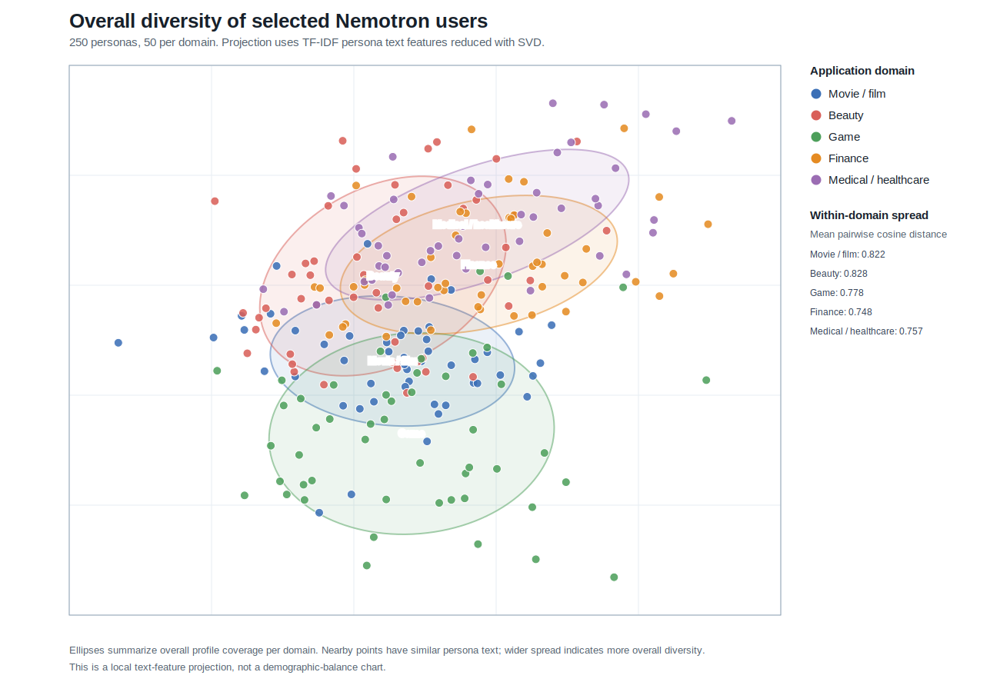

# Nemotron Overall Diversity Visualization

This figure visualizes the 250 selected Nemotron personas from `nemotron_test_users_50_per_domain.md`: 50 users per application domain.

## Method

This is an **overall-diversity** view, not a demographic- or dimension-specific diversity chart.

- Build one text representation per selected persona using demographics, persona sections, attributes, and background fields.
- Convert persona text to TF-IDF features with unigram and bigram terms.
- Reduce persona text features to two dimensions with truncated SVD.
- Color points by application domain and draw a light coverage ellipse for each domain.

Interpretation: wider spread within a color indicates broader overall profile coverage for that domain. Overlap between colors indicates cross-domain persona similarity, which can be useful for testing whether applications distinguish domain needs rather than only broad demographics.

## Overall Diversity Metrics

| Domain | Users | Mean pairwise cosine distance | Median pairwise cosine distance | Mean projected radius | P90 projected radius |
|---|---:|---:|---:|---:|---:|
| Movie / film | 50 | 0.822 | 0.843 | 0.057 | 0.112 |
| Beauty | 50 | 0.828 | 0.874 | 0.092 | 0.163 |
| Game | 50 | 0.778 | 0.832 | 0.093 | 0.184 |
| Finance | 50 | 0.748 | 0.766 | 0.067 | 0.110 |
| Medical / healthcare | 50 | 0.757 | 0.779 | 0.073 | 0.136 |

The pairwise cosine-distance metrics are computed in the reduced persona-text feature space. They are better suited for comparing within-domain spread than visual distances alone.

## Practical Takeaway

The selected users are not intended to be balanced by one visible field. They are intended to cover different overall persona profiles within each application domain, while preserving domain relevance. The detailed rationale for each selected user remains in `nemotron_test_users_50_per_domain.md`.