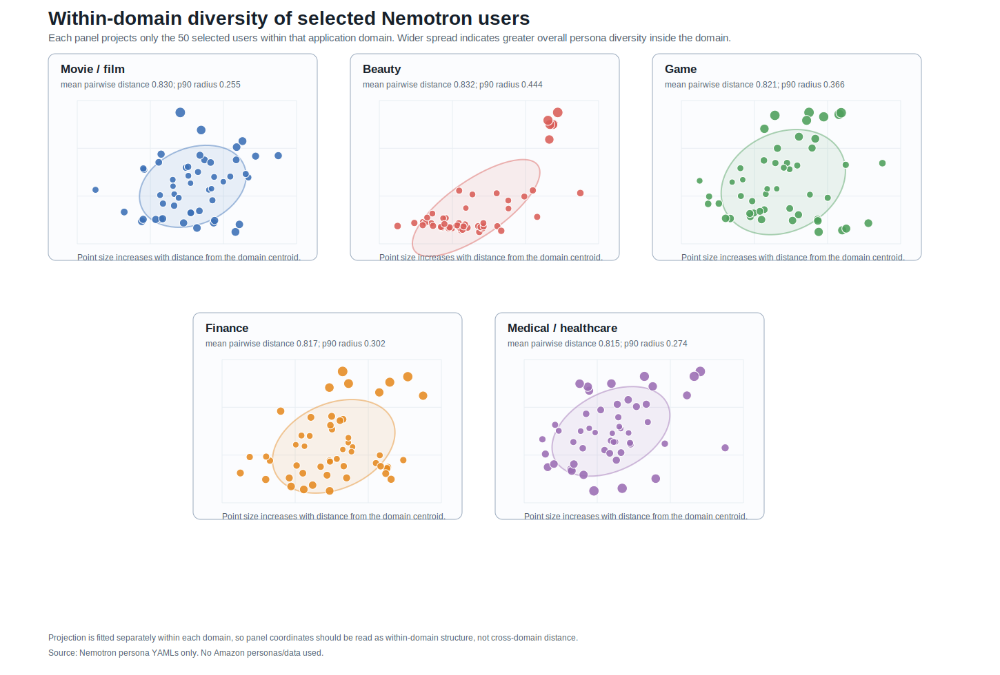

# Nemotron Within-Domain Diversity Visualization

This figure visualizes diversity **inside each application domain**. Each panel uses only the 50 selected users for that domain, so the figure answers: within this domain, are the selected personas spread across different overall profile types?

## Method

- Build one text representation per selected persona from demographics, persona sections, attributes, and background fields.
- For each domain separately, convert the 50 persona texts into TF-IDF unigram/bigram features.
- Reduce each domain-specific feature matrix to two dimensions with truncated SVD.
- Draw one panel per domain with a light coverage ellipse.
- Size points by distance from that domain panel centroid, so larger points are more distinct within that domain.

Panel coordinates are not comparable across domains because each panel is fit separately. This is intentional: the goal is within-domain diversity, not cross-domain separation.

## Within-Domain Diversity Metrics

| Domain | Users | Mean pairwise cosine distance | Median pairwise cosine distance | Mean projected radius | P90 projected radius | Distinct examples |
|---|---:|---:|---:|---:|---:|---|
| Movie / film | 50 | 0.830 | 0.850 | 0.156 | 0.255 | Nemotron_FB773423.yaml; Nemotron_DCE8F389.yaml; Nemotron_ED5FAE08.yaml |
| Beauty | 50 | 0.832 | 0.868 | 0.163 | 0.444 | Nemotron_F174C00B.yaml; Nemotron_E1B623BE.yaml; Nemotron_B6BD82BB.yaml |
| Game | 50 | 0.821 | 0.859 | 0.186 | 0.366 | Nemotron_BC95D407.yaml; Nemotron_F28427DA.yaml; Nemotron_30B017A3.yaml |
| Finance | 50 | 0.817 | 0.839 | 0.150 | 0.302 | Nemotron_6D97E519.yaml; Nemotron_2A2DC2F3.yaml; Nemotron_B456CEFB.yaml |
| Medical / healthcare | 50 | 0.815 | 0.844 | 0.147 | 0.274 | Nemotron_EB99965E.yaml; Nemotron_78EFE608.yaml; Nemotron_0D2E1D6E.yaml |

## Interpretation

The mean pairwise cosine distance is computed before projection in the reduced persona-text feature space. Higher values indicate that the selected users in that domain are more textually/profile diverse overall. The projection is a visual aid for spotting concentration or multiple profile regions within each domain.